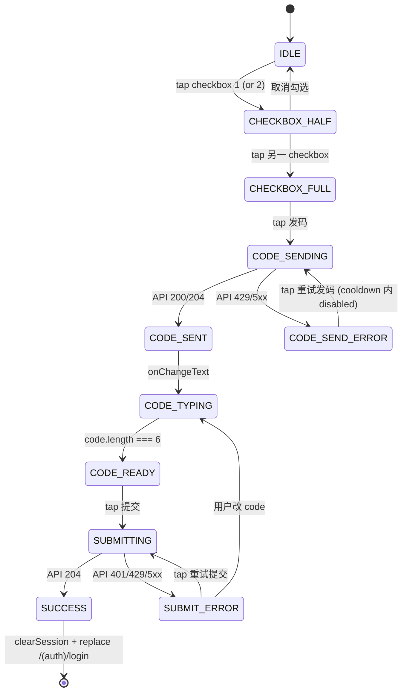
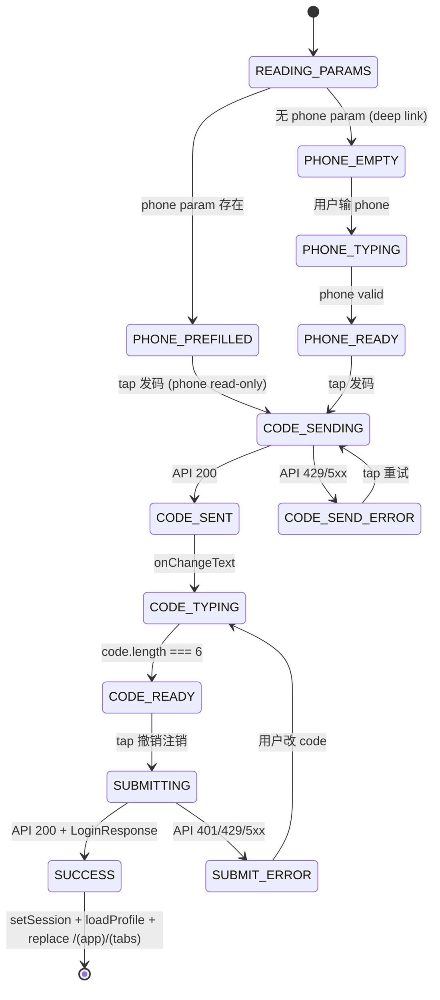
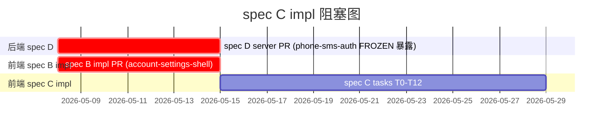

# Plan: Delete Account & Cancel Deletion UI (spec C)

> **Companion**: [`spec.md`](./spec.md) — 业务规则与验收标准
> **ADR alignment**: [ADR-0017](../../../../docs/adr/0017-sdd-business-flow-first-then-mockup.md) 类 1 标准 UI 流程(占位 UI 阶段不做视觉决策,PHASE 2 mockup 由 Claude Design 落地后回填本 plan UI 段)
> **里程碑依赖**: spec B impl ship + spec D server PR ship → spec C impl session 才开
> **状态**: Draft(pending /speckit.tasks + /speckit.analyze)

---

## Context

spec.md 已把 9 User Story / 22 FR / 10 SC / 5 Q-decisions / 5 CL 写清。本 plan 不重复业务规则,只固化:

1. **关键技术决策**(Q-decisions / CL 之外的实现路径选择,plan 阶段定型)
2. **文件清单与路由树**(改哪些文件 / 新建哪些文件)
3. **State machine**(delete-account form / cancel-deletion form / login flow + freeze modal)
4. **packages/auth 4 wrapper signature 草稿**(为 tasks T0 提供精确签名)
5. **UI 段(占位版,pending mockup)** per ADR-0017 类 1 边界
6. **衔接边界**(spec B / spec D / spec A AuthGate / mockup PHASE 2)
7. **测试策略**(分类:wrapper / form state / login flow / 真后端冒烟)
8. **实现 stage 预排**(为 tasks 提供分组锚点)

---

## 关键决策

### 决策 1 — `(auth)/cancel-deletion` 是独立 page 而非 modal-inside-login

**问题**:cancel-deletion 流程(phone + 发码 + 输码 + 提交)是注入到 `(auth)/login.tsx` 内 modal 还是独立 page?

**决议**:**独立 page** `apps/native/app/(auth)/cancel-deletion.tsx`

**Why**:

- 流程是多步表单(phone + SMS code 6 位 + 提交),modal 内承载会拥挤
- deep link 安全(per CL-003)需要独立 route
- 与拦截 modal(US4)语义分离:modal 是 trigger gateway,page 是 form container
- 与 login.tsx 解耦,login.tsx 仅扩展 mapApiError + freeze modal trigger,不承载 cancel-deletion 流程

**How to apply**:

- 路由声明:`(auth)/_layout.tsx` 加 `<Stack.Screen name="cancel-deletion" options={{ title: '撤销注销' }} />`
- 文件:`apps/native/app/(auth)/cancel-deletion.tsx`(新建)
- 跳转:US5 modal [撤销] → `router.push('/(auth)/cancel-deletion?phone=' + encodeURIComponent(phone))`

### 决策 2 — freeze modal 嵌入 `login.tsx` 而非抽独立组件

**问题**:Open Q5 — freeze modal 是嵌入 login.tsx 内还是抽 `(auth)/components/freeze-modal.tsx`?

**决议**:**嵌入 login.tsx** 内

**Why**:

- 占位 UI 阶段不抽 packages/ui 新组件(per ADR-0017 类 1 边界);本地嵌入与该约束一致
- modal 仅 login flow catch ACCOUNT_IN_FREEZE_PERIOD 时触发,跨 page 复用度 = 0(无需抽出)
- PHASE 2 mockup 落地时若需视觉复用度 / 跨场景复用,届时再抽 — 不预设抽象
- 单文件(login.tsx)承载 form + freeze modal 仍 ≤ 200 行,不嫌乱

**How to apply**:

- modal 实现:login.tsx 内组件局部 state `const [showFreezeModal, setShowFreezeModal] = useState(false)`
- mapApiError 'frozen' kind 时 setShowFreezeModal(true)
- modal `<Modal animationType='fade' transparent visible={showFreezeModal}>` 嵌入 login.tsx 末端
- 文案集中在 login.tsx `const COPY = { ... }` 内

### 决策 3 — mapDeletionError 函数位置

**问题**:Open Q6 — `mapDeletionError`(FR-009) + `mapCancelDeletionError`(FR-009 cancel-deletion 路径)放哪?

**决议**:**各 page 自带**

- `delete-account.ts`(伴文件) — 含 `mapDeletionError(error): { kind, toast }`
- `cancel-deletion.ts`(伴文件) — 含 `mapCancelDeletionError(error): { kind, toast }`

**Why**:

- 与 spec A onboarding `(auth)/login.tsx` + `login.ts` 同款 pattern(伴文件含 errorMap 函数)
- 错误映射逻辑 page-specific(delete-account 失败码包含 INVALID_DELETION_CODE / 限流;cancel-deletion 失败码包含 INVALID_CREDENTIALS / 限流 / 反枚举),抽到公共 lib/errors/ 反而引入跨 page 耦合
- `lib/errors/` 不预占位;若 PHASE 2 / M2 多 page 共用映射逻辑(如统一限流文案),届时再抽

**How to apply**:

- 文件:`apps/native/app/(app)/settings/account-security/delete-account.ts`(伴文件)
- 文件:`apps/native/app/(auth)/cancel-deletion.ts`(伴文件)
- 函数 signature(草稿):

  ```ts
  type MappedError = {
    kind: 'rate_limit' | 'invalid_code' | 'network' | 'unknown';
    toast: string;
  };
  function mapDeletionError(e: unknown): MappedError;
  function mapCancelDeletionError(e: unknown): MappedError;
  ```

### 决策 4 — 6 位 code 输入不自动提交

**问题**:Open Q1 — 输满 6 位 code 是否自动 trigger 提交?

**决议**:**(b) 需 tap 提交按钮**(占位倾向)

**Why**:

- UX 一致性:与 phone-sms-auth login.tsx 输 SMS 提交习惯对齐(login 也需 tap 登录按钮)
- 占位 UI 简化:不引入 onChangeText 内的提交副作用,状态机更透明
- 防误触:用户输错最后一位时,自动提交无回退余地
- PHASE 2 mockup 评估"自动提交"是否更佳 UX(如 banking app 常见 pattern),届时再迁

**How to apply**:

- TextInput onChangeText 仅 strip 非数字 + 写 state;不调 submit()
- 提交按钮启用条件:`code.length === 6 && hasSentCode && !isSubmitting`

### 决策 5 — Android 硬件 back 在拦截 modal 等价 [保持]

**问题**:Open Q2 — Android hardware back 在 modal 显示时行为?

**决议**:**(a) 等价 [保持]**(modal close + 清 form)

**Why**:

- 与 RN `<Modal onRequestClose={...}>` 默认行为一致(Android back 触发 onRequestClose)
- UX 一致性:back 通常等价"取消 / 关闭",[保持] 语义匹配
- 防"用户被困 modal":阻断 back 反而引发用户找强制关 app 的行为
- iOS 无 hardware back,只 [保持] [撤销] 双 button(无降级)

**How to apply**:

- `<Modal onRequestClose={handleKeep}>` 直接绑 [保持] 同函数 handler
- 测试 SC-003 / Acceptance 加 back 等价 [保持] 断言

### 决策 6 — 拦截 modal 不提供 ⨉ close button

**问题**:Open Q3 — modal 视觉是否有右上角 ⨉?

**决议**:**(b) 不提供**(占位 UI 阶段)

**Why**:

- 占位 UI 阶段不做视觉装饰决策(per ADR-0017 类 1 边界第 4 项);Pressable 装饰 = 视觉决策
- [保持] 语义已覆盖"关闭 modal" 路径,⨉ 冗余
- PHASE 2 mockup 评估视觉风格再决定(常见 iOS modal 顶部 hairline + ⨉,Android material modal 不带)

**How to apply**:

- `<Modal>` 内仅渲染 [撤销] [保持] 双 button,无 ⨉ icon
- a11y `accessibilityRole='alert'` + `accessibilityViewIsModal=true`(iOS)

### 决策 7 — cancel-deletion 成功不显示 toast

**问题**:Open Q7 — cancel-deletion 成功后是否 toast "已撤销注销"?

**决议**:**(a) 不显示 toast**

**Why**:

- M1.3 无 toast / snackbar infra(grep `react-native-toast-message` / `Toast` lib 0 命中);引入 lib 是新依赖决策,占位 UI 阶段不做
- 沿用 phoneSmsAuth login 成功无 toast pattern(直接跳 home,UX 一致)
- "撤销成功"信号 = 用户被跳到 home(默认认知);冗余 toast 占视觉空间
- PHASE 2 mockup 评估 transient toast 是否提升 UX(尤其首次撤销用户可能困惑)

**How to apply**:

- cancel-deletion success path:setSession + loadProfile + router.replace(无 toast 调用)
- 占位 UI 阶段 0 toast import;PHASE 2 mockup 落地若引入 toast lib 由 mockup PR 单独决

### 决策 8 — phone input 使用 `keyboardType='phone-pad'` + `autoComplete='tel'`

**问题**:cancel-deletion phone input(CL-003 deep link 路径下 editable)用什么 keyboard / a11y?

**决议**:**`keyboardType='phone-pad'` + `autoComplete='tel'` + `inputMode='tel'`(Web 兼容)**

**Why**:

- 与 `(auth)/login.tsx` phone input(use-login-form.ts 候选 既有 phone input)风格对齐;impl T1 时实际 grep 既有 login phone input 复制配置即可
- 沿用 ADR-0016 phone 输入习惯(`+86`-前缀,允许用户输 E.164 格式)
- 输入正则验证延迟到提交时(后端 `^\+\d{8,15}$` 是单一真相源,前端 minimal validation)

**How to apply**:

- TextInput props:`keyboardType='phone-pad' inputMode='tel' autoComplete='tel' textContentType='telephoneNumber'`
- 输入预填(US5 路径)时 input 仍设 `editable={false}` + 显 maskPhone 后(防误改)

---

## 文件清单与路由树

```text
no-vain-years-app/
├── apps/native/
│   ├── app/
│   │   ├── (auth)/
│   │   │   ├── _layout.tsx                          # 改:加 Stack.Screen name="cancel-deletion"
│   │   │   ├── login.tsx                            # 改:扩 mapApiError 'frozen' + freeze modal 嵌入
│   │   │   ├── login.ts                             # 改:mapApiError switch 加 ACCOUNT_IN_FREEZE_PERIOD case
│   │   │   ├── use-login-form.ts                    # 改:catch 'frozen' kind 触发 setShowFreezeModal(true)
│   │   │   └── cancel-deletion.tsx                  # 新增:cancel-deletion form page (US7-8 容器)
│   │   │   └── cancel-deletion.ts                   # 新增:伴文件含 mapCancelDeletionError
│   │   └── (app)/settings/account-security/
│   │       ├── _layout.tsx                          # 改:加 Stack.Screen name="delete-account"(此文件由 spec B impl 创建,spec C impl 时改)
│   │       ├── delete-account.tsx                   # 新增:delete-account form page (US1-3 容器)
│   │       └── delete-account.ts                    # 新增:伴文件含 mapDeletionError
│   └── packages/auth/src/
│       └── usecases.ts                              # 改:新增 4 wrapper(per FR-004)
├── packages/api-client/src/
│   ├── generated/
│   │   ├── apis/
│   │   │   ├── AccountDeletionControllerApi.ts      # 新增(由 pnpm api:gen 生成,impl T0)
│   │   │   └── CancelDeletionControllerApi.ts       # 新增(由 pnpm api:gen 生成,impl T0)
│   │   └── models/
│   │       ├── DeleteAccountRequest.ts              # 新增(同上)
│   │       ├── SendCancelDeletionCodeRequest.ts     # 新增(同上)
│   │       ├── CancelDeletionRequest.ts             # 新增(同上)
│   │       └── LoginResponse.ts                     # 复用(server 返与 phone-sms-auth 字节级一致)
│   └── client.ts                                    # 不改(fetch interceptor 沿用)
```

**变更总览**:

- 改 5 文件:`(auth)/_layout.tsx` / `(auth)/login.tsx` / `(auth)/login.ts` / `(auth)/use-login-form.ts` / `(app)/settings/account-security/_layout.tsx`(后者依赖 spec B impl 已落)+ `packages/auth/src/usecases.ts`
- 新建 4 文件:`(auth)/cancel-deletion.tsx` + `cancel-deletion.ts` + `(app)/settings/account-security/delete-account.tsx` + `delete-account.ts`
- 自动生成 5 文件:SDK generated/(由 `pnpm api:gen` 跑出,impl T0)

---

## State Machine

### delete-account form



### cancel-deletion form



### login flow + freeze modal

```mermaid
stateDiagram-v2
    [*] --> LOGIN_IDLE
    LOGIN_IDLE --> LOGIN_SUBMITTING: tap 登录
    LOGIN_SUBMITTING --> LOGIN_SUCCESS: API 200
    LOGIN_SUBMITTING --> LOGIN_ERROR_INVALID: mapApiError 'invalid'
    LOGIN_SUBMITTING --> LOGIN_ERROR_RATE: mapApiError 'rate_limit'
    LOGIN_SUBMITTING --> LOGIN_ERROR_NET: mapApiError 'network'
    LOGIN_SUBMITTING --> FROZEN_MODAL: mapApiError 'frozen' (per FR-010 spec D)
    FROZEN_MODAL --> LOGIN_IDLE: tap [保持] / Android back / onRequestClose (form cleared)
    FROZEN_MODAL --> [/(auth)/cancel-deletion]: tap [撤销] (router.push + ?phone=...)
    LOGIN_SUCCESS --> [*]: setSession + replace /(app)/(tabs)
    LOGIN_ERROR_INVALID --> LOGIN_IDLE: tap 重试
    LOGIN_ERROR_RATE --> LOGIN_IDLE: tap 重试 (cooldown)
    LOGIN_ERROR_NET --> LOGIN_IDLE: tap 重试
```

---

## packages/auth 4 wrapper signature 草稿

实现位置:`packages/auth/src/usecases.ts`(模仿 phoneSmsAuth / loadProfile / logoutAll 既有 pattern,per usecases.ts:55-117)

### 1. requestDeleteAccountSmsCode

```ts
export async function requestDeleteAccountSmsCode(): Promise<void> {
  await getAccountDeletionApi().sendDeletionCode();
  // SDK 自动注入 Bearer(per existing fetch interceptor)
  // 无需写 store(本调用不影响 auth state)
}
```

### 2. deleteAccount

```ts
export async function deleteAccount(code: string): Promise<void> {
  try {
    await getAccountDeletionApi().deleteAccount({
      deleteAccountRequest: { code },
    });
  } finally {
    // server 端已作废 session,前端必须清(per FR-008 / 决策 1 不重复 logoutAll)
    useAuthStore.getState().clearSession();
  }
}
```

### 3. requestCancelDeletionSmsCode

```ts
export async function requestCancelDeletionSmsCode(phone: string): Promise<void> {
  await getCancelDeletionApi().sendCancelDeletionCode({
    sendCancelDeletionCodeRequest: { phone },
  });
  // 无 Bearer(SDK fetch interceptor 检测 path 自动跳过 auth header)
}
```

### 4. cancelDeletion

```ts
export async function cancelDeletion(phone: string, code: string): Promise<void> {
  const response = await getCancelDeletionApi().cancelDeletion({
    cancelDeletionRequest: { phone, code },
  });
  // response: { accountId, accessToken, refreshToken } — LoginResponse type
  useAuthStore.getState().setSession({
    accountId: response.accountId,
    accessToken: response.accessToken,
    refreshToken: response.refreshToken,
  });
  await loadProfile(); // 写入 displayName + phone(per spec B FR-011 扩展后)
}
```

**Mock factory 兼容**:`packages/auth/src/__mocks__/usecases.ts` 若存在(grep 验证,impl T0 阶段)→ 同步加 4 个 mock function(per 全局 memory `feedback_new_export_grep_mock_factories.md`)

---

## UI 段(占位版,pending mockup)

per ADR-0017 类 1 边界,本段仅写**业务流可验**的占位结构;视觉决策(精确 padding / hex / 字号 / 圆角 / 阴影 / 自定义动画 / icon 装饰)留 PHASE 2 mockup 落地后回填本段。

### delete-account.tsx 占位结构

```tsx
// PHASE 1 PLACEHOLDER — business flow validated; visuals pending mockup.
const COPY = {
  title: '注销账号',
  warning1: '注销后账号进入 15 天冻结期,期间可登录撤销恢复',
  warning2: '冻结期满后账号数据将永久匿名化,不可恢复',
  checkbox1: '我已知晓 15 天冻结期可撤销',
  checkbox2: '我已知晓期满后数据匿名化不可逆',
  sendCode: '发送验证码',
  resendCooldown: (s: number) => `${s}s 后可重发`,
  codePlaceholder: '请输入 6 位验证码',
  submit: '确认注销',
  submitting: 'submitting...',
  errorRateLimit: '操作太频繁,请稍后再试',
  errorInvalidCode: '验证码错误',
  errorNetwork: '网络错误,请重试',
  errorUnknown: '发生未知错误',
};

export default function DeleteAccountScreen() {
  // States: checkbox1, checkbox2, code, hasSentCode, cooldown, isSubmitting, errorMsg
  return (
    <View style={{ flex: 1, padding: 16 }}>
      <Text>{COPY.warning1}</Text>
      <Text>{COPY.warning2}</Text>
      <Pressable
        onPress={() => setCheckbox1(!checkbox1)}
        accessibilityState={{ checked: checkbox1 }}
      >
        <Text>
          {checkbox1 ? '☑ ' : '☐ '}
          {COPY.checkbox1}
        </Text>
      </Pressable>
      <Pressable
        onPress={() => setCheckbox2(!checkbox2)}
        accessibilityState={{ checked: checkbox2 }}
      >
        <Text>
          {checkbox2 ? '☑ ' : '☐ '}
          {COPY.checkbox2}
        </Text>
      </Pressable>
      <Pressable
        disabled={!(checkbox1 && checkbox2) || cooldown > 0 || isSendingCode}
        onPress={handleSendCode}
        style={{ opacity: !(checkbox1 && checkbox2) || cooldown > 0 ? 0.5 : 1 }}
      >
        <Text>{cooldown > 0 ? COPY.resendCooldown(cooldown) : COPY.sendCode}</Text>
      </Pressable>
      <TextInput
        value={code}
        onChangeText={(t) => setCode(t.replace(/\D/g, '').slice(0, 6))}
        keyboardType="number-pad"
        inputMode="numeric"
        maxLength={6}
        editable={hasSentCode && !isSubmitting}
        placeholder={COPY.codePlaceholder}
      />
      <Pressable
        disabled={!hasSentCode || code.length !== 6 || isSubmitting}
        onPress={handleSubmit}
        style={{ opacity: !hasSentCode || code.length !== 6 || isSubmitting ? 0.5 : 1 }}
        accessibilityState={{ disabled: isSubmitting, busy: isSubmitting }}
      >
        <Text>{isSubmitting ? COPY.submitting : COPY.submit}</Text>
      </Pressable>
      {errorMsg && <Text>{errorMsg}</Text>}
    </View>
  );
}
```

### cancel-deletion.tsx 占位结构

```tsx
// PHASE 1 PLACEHOLDER — business flow validated; visuals pending mockup.
const COPY = {
  title: '撤销注销',
  description: '请通过手机号验证码撤销注销,恢复账号',
  phonePlaceholder: '请输入手机号(如 +86138...)',
  sendCode: '发送验证码',
  resendCooldown: (s: number) => `${s}s 后可重发`,
  codePlaceholder: '请输入 6 位验证码',
  submit: '撤销注销',
  submitting: 'submitting...',
  errorRateLimit: '操作太频繁,请稍后再试',
  errorInvalidCredentials: '凭证或验证码无效',
  errorNetwork: '网络错误,请重试',
  errorUnknown: '发生未知错误',
};

export default function CancelDeletionScreen() {
  const params = useLocalSearchParams<{ phone?: string }>();
  const router = useRouter();
  const [phone, setPhone] = useState('');
  const [phoneReadOnly, setPhoneReadOnly] = useState(false);
  // 第一动作:读 param + setParams undefined(per FR-013 + FR-022 安全)
  useEffect(() => {
    if (params.phone) {
      setPhone(decodeURIComponent(params.phone));
      setPhoneReadOnly(true);
      router.setParams({ phone: undefined });
    }
  }, []);
  // 余下 state: code, hasSentCode, cooldown, isSubmitting, errorMsg
  return (
    <View style={{ flex: 1, padding: 16 }}>
      <Text>{COPY.description}</Text>
      <TextInput
        value={phoneReadOnly ? maskPhone(phone) : phone}
        onChangeText={setPhone}
        keyboardType="phone-pad"
        inputMode="tel"
        autoComplete="tel"
        textContentType="telephoneNumber"
        editable={!phoneReadOnly}
        placeholder={COPY.phonePlaceholder}
      />
      <Pressable disabled={!phone || cooldown > 0 || isSendingCode} onPress={handleSendCode}>
        <Text>{cooldown > 0 ? COPY.resendCooldown(cooldown) : COPY.sendCode}</Text>
      </Pressable>
      <TextInput
        value={code}
        onChangeText={(t) => setCode(t.replace(/\D/g, '').slice(0, 6))}
        keyboardType="number-pad"
        inputMode="numeric"
        maxLength={6}
        editable={hasSentCode && !isSubmitting}
        placeholder={COPY.codePlaceholder}
      />
      <Pressable
        disabled={!hasSentCode || code.length !== 6 || isSubmitting}
        onPress={handleSubmit}
      >
        <Text>{isSubmitting ? COPY.submitting : COPY.submit}</Text>
      </Pressable>
      {errorMsg && <Text>{errorMsg}</Text>}
    </View>
  );
}
```

### freeze modal(嵌入 login.tsx)占位结构

```tsx
// 在 login.tsx 末端追加,与 form 同 component scope
const FREEZE_COPY = {
  title: '账号处于注销冻结期',
  description: '可撤销注销恢复账号',
  cancelDelete: '撤销',
  keepDelete: '保持',
};

// State: const [showFreezeModal, setShowFreezeModal] = useState(false);

// 在 use-login-form.ts catch 块改为:
// catch (e) {
//   const mapped = mapApiError(e);
//   if (mapped.kind === 'frozen') setShowFreezeModal(true);
//   else setErrorMessage(mapped.toast);
// }

// JSX 末端:
<Modal
  animationType="fade"
  transparent={true}
  visible={showFreezeModal}
  onRequestClose={handleKeep} // Android back 等价 [保持]
  accessibilityViewIsModal={true}
>
  <View
    style={{
      flex: 1,
      justifyContent: 'center',
      alignItems: 'center',
      backgroundColor: 'rgba(0,0,0,0.5)',
    }}
  >
    <View style={{ backgroundColor: 'white', padding: 16 }} accessibilityRole="alert">
      <Text>{FREEZE_COPY.title}</Text>
      <Text>{FREEZE_COPY.description}</Text>
      <Pressable onPress={handleCancelDelete}>
        <Text>{FREEZE_COPY.cancelDelete}</Text>
      </Pressable>
      <Pressable onPress={handleKeep}>
        <Text>{FREEZE_COPY.keepDelete}</Text>
      </Pressable>
    </View>
  </View>
</Modal>;

// handlers:
const handleCancelDelete = () => {
  setShowFreezeModal(false);
  router.push(`/(auth)/cancel-deletion?phone=${encodeURIComponent(form.phone)}`);
};
const handleKeep = () => {
  setShowFreezeModal(false);
  // 清 form
  resetForm(); // 调 react-hook-form reset 或等价
};
```

> **PHASE 2 mockup 回填位置**:本段全部 `<View>` / `<Text>` / `<Pressable>` 替换为 NativeWind className(参考 `.claude/nativewind-mapping.md`);精确 padding / 颜色 / 字号 / 阴影 / 动画 / icon 装饰由 mockup 落地;modal 视觉(顶部 hairline / 圆角 / 阴影 / icon)由 PHASE 2 mockup 决。本段是业务流锚点,**不是视觉规范**。

---

## 衔接边界

### 与 spec A `(my-profile)`(已 ship)

- AuthGate 第二层 onboarding gate **不变**(per CL-001):cancel-deletion 成功后跳 `/(app)/(tabs)`,若 onboarding flag 被 server 清,自然走 onboarding gate;spec C 不预处理
- spec A FR-005 `(tabs)/profile` ⚙️ tap → `(app)/settings` 入口已 ship,spec B impl 后 settings/index 落地,spec C 入口链路完整

### 与 spec B `account-settings-shell`(docs 已落,impl 后置)

- spec B `account-security/index` FR-007 占位 `router.push('/(app)/settings/account-security/delete-account')` 已写;spec C impl 创建该 page 后 push 立即可用
- spec B `account-security/_layout.tsx` 由 spec B impl 创建;spec C impl 时**仅追加** `<Stack.Screen name="delete-account" options={{ title: '注销账号' }} />` 一行
- spec B FR-011 扩展 `useAuthStore.phone`(spec B impl 落地)→ spec C `loadProfile()` 调用后 store 含 phone(per FR-004 cancelDeletion 的 setSession + loadProfile 链)
- **spec C impl 时序**:必须 spec B impl ship 后再开,否则 `account-security/_layout.tsx` 不存在;**spec B impl 不延** 是单条阻塞依赖

### 与 spec D `server phone-sms-auth FROZEN 错误码暴露`(后置,server 仓另起)

- spec D 假设契约(per spec.md 决策约束):`phone-sms-auth` 返 `ACCOUNT_IN_FREEZE_PERIOD` 错误码(具体 HTTP code 由 spec D 决,spec C `mapApiError` 映射时按错误码字段读)
- spec C FR-010 `mapApiError` 加 `case 'ACCOUNT_IN_FREEZE_PERIOD' → 'frozen'` 实际等待 spec D ship 测试
- **spec C impl 时序**:必须 spec D ship 后再开,否则 mapApiError 'frozen' 分支无 server 信号触发,US4-7 集成 / 真后端冒烟无法验证
- **spec C 实现**:基于 mock(msw 模拟错误码)可先开发 wrappers + form impl;但 SC-006 真后端冒烟阻塞 spec D

### 与 mockup PHASE 2(per ADR-0017 后置)

- 本 plan UI 段全部"占位结构"PHASE 2 mockup 落地后**回填**:
  - `<View>` / `<Text>` / `<Pressable>` 替换为 NativeWind className(`bg-brand-50 px-md py-sm rounded-md` 等)
  - 精确 padding / 颜色 / 字号 / 阴影 / 动画 / icon 装饰由 mockup 决
  - modal 视觉风格(顶部 hairline / 圆角 / 阴影 / 关闭 icon 是否加)由 mockup 决
  - 警示 icon / 危险按钮(destructive style)由 mockup 决
- mockup 落地后 plan.md UI 段标 `## UI 结构(mockup PHASE 2 落地版)` 替换占位段
- spec C tasks 不含 mockup 任务(per spec.md Out of Scope);PHASE 2 单起任务

---

## 里程碑依赖



**关键**:

- spec C impl session 在 spec B impl + spec D server PR **均** ship 后开
- spec B 与 spec D **可并行**(无相互依赖):spec B 不需 spec D,spec D 不需 spec B
- spec C tasks T0(SDK gen) + T1(packages/auth wrapper) 在 spec D ship 后**先跑**(SDK 必须含 deletion controllers);后续 form impl 任务跟随
- 若 spec D 无限期延后,spec C tasks 可基于 mock 跑到 form impl + unit test 完成,但**SC-006 真后端冒烟阻塞** — 不进 PR / impl session 不结束

---

## 测试策略

### 单测(per SC-001)

| 模块                      | 文件                                                                      | 范围                                                   | 工具         |
| ------------------------- | ------------------------------------------------------------------------- | ------------------------------------------------------ | ------------ |
| packages/auth wrappers    | `packages/auth/src/usecases.test.ts`(扩 既有)                             | 4 wrapper happy + error path(mock SDK fetch)           | vitest + msw |
| delete-account form       | `apps/native/app/(app)/settings/account-security/delete-account.test.tsx` | 状态机转换(IDLE → CHECKBOX → ... → SUCCESS / ERROR)    | vitest + RTL |
| cancel-deletion form      | `apps/native/app/(auth)/cancel-deletion.test.tsx`                         | 同上 + 有/无 phone param 分支                          | vitest + RTL |
| login flow + freeze modal | `apps/native/app/(auth)/login.test.tsx`(扩 既有)                          | mapApiError 'frozen' 触发 modal(US4 acceptance 5 反例) | vitest + RTL |
| mapDeletionError fn       | `apps/native/app/(app)/settings/account-security/delete-account.test.ts`  | 错误码映射 happy path + edge case                      | vitest       |
| mapCancelDeletionError fn | `apps/native/app/(auth)/cancel-deletion.test.ts`                          | 同上                                                   | vitest       |

### 集成 / 真后端冒烟(per SC-006)

- **依赖 spec D ship**(否则无 ACCOUNT_IN_FREEZE_PERIOD 信号触发)
- **依赖 spec B impl ship**(否则 account-security/index 入口不存在)
- 路径:测试账号 → 注销发起 → 立即用同手机号尝试登录 → modal 触发 → tap [撤销] → cancel-deletion 提交 → 跳 home
- 截图归档:`runtime-debug/2026-05-XX-delete-account-cancel-deletion-business-flow/`(per spec B SC-006 同款 pattern)
- 工具:Playwright 跑 RN Web bundle(M2 引入 detox 后再加 native 真机测)

### 反枚举不变性(per SC-008)

- grep 静态分析 cancel-deletion.tsx 内不出现"phone 未注册" / "账号已匿名化" / "冻结期已过期" 等细分文案 — 全部映射 "凭证或验证码无效"

---

## 实现 stage 预排(为 tasks.md 提供锚点)

| Stage  | 范围                                                                                   | 阻塞依赖                                           |
| ------ | -------------------------------------------------------------------------------------- | -------------------------------------------------- |
| **S0** | `pnpm api:gen` 拉 spec D ship 后的最新后端 OpenAPI(自动生成 SDK)                       | spec D ship                                        |
| **S1** | packages/auth 4 wrapper + 单测                                                         | S0                                                 |
| **S2** | delete-account.tsx + 伴文件 + 单测                                                     | S1 + spec B impl ship                              |
| **S3** | login.tsx + login.ts + use-login-form.ts mapApiError 扩 + freeze modal 嵌入 + 单测     | S1                                                 |
| **S4** | cancel-deletion.tsx + 伴文件 + 单测                                                    | S1                                                 |
| **S5** | `(auth)/_layout.tsx` + `(app)/settings/account-security/_layout.tsx` Stack.Screen 注册 | S2 + S4 + spec B impl                              |
| **S6** | 集成测 + 真后端冒烟 + 截图归档                                                         | S2 + S3 + S4 + S5 + spec D ship + spec B impl ship |

每 stage 独立可 commit;tasks.md 按 stage 拆 task。

---

## 与既有 conventions / 约定衔接

- **SDD**(`docs/conventions/sdd.md`):本 plan 严格按 spec-kit canonical workflow 走;tasks.md 落地后跑 `/speckit.analyze` 一致性扫
- **ADR-0017** 类 1 标准 UI:占位 UI 段全裸 RN,mockup PHASE 2 后回填
- **业务命名**(`docs/conventions/business-naming.md`):`delete-account` / `cancel-deletion` 全英;不混拼音
- **API 契约**(`docs/conventions/api-contract.md`):前端 SDK 由 `pnpm api:gen` 单一生成,禁手写 fetch
- **代码质量**(`docs/conventions/code-quality.md`):ESLint + Prettier + husky 既有不变;新文件按既有风格(NativeWind className 占位 RN 不用)
- **占位 UI 4 边界**(per ADR-0017):FR-014 严格遵守,SC-005 静态 grep 验证
