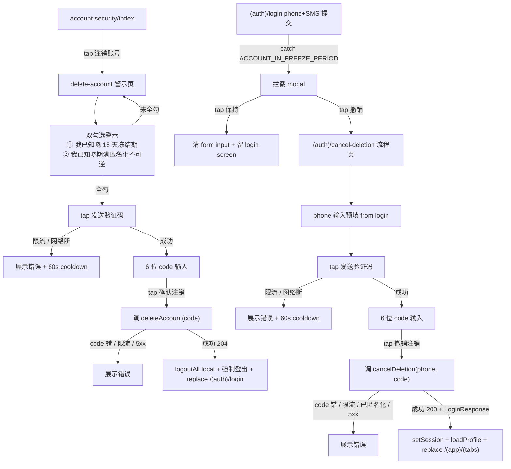

# Feature Specification: Delete Account & Cancel Deletion UI (M1.X — 注销账号 + 冻结期撤销 UI)

**Feature Branch**: `feature/delete-account-cancel-deletion-ui-spec`
**Created**: 2026-05-07（per [ADR-0017](../../../../docs/adr/0017-sdd-business-flow-first-then-mockup.md) 类 1 标准 UI 流程）
**Status**: Draft（pending /speckit.clarify + plan + tasks）
**Module**: `apps/native/app/(app)/settings/account-security/delete-account.tsx`(新增 page) + `apps/native/app/(auth)/login.tsx`(modal 注入 + mapApiError 扩展) + `apps/native/app/(auth)/cancel-deletion.tsx`(新增 page,撤销流程容器)
**Input**: User description: "注销账号 page(警示 + SMS 验证码触发 + 6 位码输入 + 双勾选确认 → server,触发 ACTIVE → FROZEN);解封拦截弹窗(phone-sms-auth login flow 检测 server 返 ACCOUNT_IN_FREEZE_PERIOD → 弹\"账号冻结期,可撤销?[撤销] [保持]\" → tap 撤销 → cancel-deletion → ACTIVE + 发 token → 跳 home)。本 spec 是 SDD 拆分链 A → B → C 的 C,衔接 spec B(account-settings-shell,docs 已落)+ 假设 spec D(server phone-sms-auth FROZEN 错误码暴露)。"

> 决策约束:
>
> - **per [ADR-0017](../../../../docs/adr/0017-sdd-business-flow-first-then-mockup.md) 类 1 流程**:本 spec 阶段产出 docs + 业务流 + 占位 UI;视觉决策(精确 px / hex / 阴影 / 自定义动画 / 警示文案排版 / modal 自定义视觉 / 警示 icon)**不进 spec / plan**,留 PHASE 2 mockup 落地后回填 plan.md UI 段
> - **里程碑依赖** — spec C 文档(spec/plan/tasks)本 session 独立产出;Phase 2 `/speckit.implement` 必须**等 server 仓 spec D ship 后**才开:spec D 落地 `phone-sms-auth FROZEN → ACCOUNT_IN_FREEZE_PERIOD` 错误码暴露(替代当前反枚举吞 401 INVALID_CREDENTIALS),否则前端 `(auth)/login` 拦截 modal 拿不到信号
> - **后端契约假设**(spec D 后置):
>   - `phone-sms-auth` 检测 `status == FROZEN` 时,返 HTTP 错误响应含错误码 `ACCOUNT_IN_FREEZE_PERIOD`(403 / 401-with-code 字段均可,具体 spec D 决);**不**要求暴露 `freeze_until` / `freezeRemainingDays` 字段(per Q3 决议简化文案)
>   - `POST /api/v1/auth/cancel-deletion`(phone+code,无 Bearer)+ `POST /api/v1/auth/cancel-deletion/sms-codes`(phone)— **当前已落地不动**(server 仓 M1.3 PR #131-138)
>   - `POST /api/v1/accounts/me/deletion`(Bearer + code)+ `POST /api/v1/accounts/me/deletion-codes`(Bearer)— **当前已落地不动**
> - **前端 SDK 同步前置**:`packages/api-client/src/generated/apis/` 当前仅 4 controllers,**不含** AccountDeletion / CancelDeletion controllers;impl T0 必先跑 `pnpm api:gen` 拉取最新后端 OpenAPI spec 生成两 controller client
> - **路由 `(auth)/cancel-deletion`**:撤销流程容器在 `(auth)/` 路由组而非 `(app)/`,因 FROZEN 用户已 logged out,无 access token 进 `(app)/` AuthGate 会拦截
> - **占位 UI 阶段不引入 packages/ui 新组件**(per ADR-0017 类 1 边界);现有共享组件(Spinner / Button)按需复用,新组件等 PHASE 2 mockup 评估
> - 本 spec 是 SDD 拆分链 A → B → C 的 C;A → B 入口 ⚙️ 已在 spec A `(tabs)/profile` FR-005 占位 push;B → C 入口"注销账号" 已在 spec B `account-security/index` FR-007 + spec B plan.md § 衔接边界占位 `router.push('/(app)/settings/account-security/delete-account')`,目标实现是本 spec 范围
> - **packages/auth 4 wrapper 新增**:`requestDeleteAccountSmsCode` / `deleteAccount` / `requestCancelDeletionSmsCode` / `cancelDeletion`(grep 确认当前不存在,impl T0 阶段新增)

## Visual References

本 spec **不**引用截图;警示页 / 拦截 modal / cancel-deletion form 视觉占位阶段全裸 RN component(per ADR-0017 类 1 边界),PHASE 2 mockup 由 Claude Design 单独产出后回填 plan.md UI 段。

可参考的代码风格基线:`apps/native/app/(auth)/login.tsx`(phone-sms-auth login 占位风格)+ spec B `account-security/index` 占位风格(同 PHASE 1)。

完整设计哲学决策见 [`notes.md` § 04-account-security § 解封 UI 的位置](../my-profile/design/inspiration/notes.md):"解封 = cancel-deletion,语义是 FROZEN 用户**登录时**取消注销 — UX 入口在 phone-sms-auth login flow 拦截弹窗,**不在「账户与安全」list 里**。这是 spec C 的另一半。"

## Information Architecture

```mermaid
flowchart TB
    subgraph B_Spec["(app)/settings/account-security (spec B — docs 已落)"]
        AS1["account-security/index"]
    end

    subgraph C_DA["spec C — 发起注销段"]
        DA["account-security/delete-account.tsx<br/>警示 + 双勾选 + 发码 + 输码 + 提交"]
    end

    subgraph C_CD["spec C — 撤销注销段"]
        L["(auth)/login.tsx<br/>(既有,本 spec 扩展 mapApiError)"]
        M["拦截 modal<br/>仅 ACCOUNT_IN_FREEZE_PERIOD 触发"]
        CD["(auth)/cancel-deletion.tsx<br/>phone + 发码 + 输码 + 提交"]
    end

    subgraph SrvD["spec D server (后置依赖)"]
        S["phone-sms-auth FROZEN → ACCOUNT_IN_FREEZE_PERIOD"]
    end

    AS1 -->|tap 注销账号| DA
    DA -->|提交成功| Logout1[logoutAll local + replace /(auth)/login]
    L -->|catch ACCOUNT_IN_FREEZE_PERIOD<br/>(spec D 后)| M
    M -->|tap 撤销| CD
    M -->|tap 保持| L
    CD -->|提交成功| Home["(app)/(tabs) 首页"]
    S -.spec D 提供.-> L
```

## User Flow



## Clarifications

5 个核心待决问题已按用户决策对齐(2026-05-07,详见 [`notes.md` § 04 § 解封 UI 的位置](../my-profile/design/inspiration/notes.md) + 本对话 Q1-Q5):

### Q1 — 撤销注销入口路径

- **决议**: B 选项 — login flow 拦截弹窗(联动假设 spec D 改 phone-sms-auth)
- **理由**: 与 user prompt 原叙事一致,UX 自动化(用户登录被拒立即拦截,无需手动找入口);后端 spec D 改动小(仅放开 FROZEN 错误码反枚举,不需 freeze_until 字段);代价:spec C impl 阻塞 spec D ship。Alternative A(login screen 旁链接独立入口)拒绝 — 用户需主动认知"撤销"概念,UX 不自然;Alternative C(混合)与 A 等价

### Q2 — delete-account 警示页"双确认"形态

- **决议**: A 选项 — 单页(警示 + 双勾选 + 发码 + 输码 + 提交)
- **理由**: 后端 body 仅 `{code}` 无 password(M1 phone-sms-auth 无密码),"双确认" 应理解为「勾选警示 + SMS 验证码」,不含密码二因子;单页减少跳转,与 phone-sms-auth login.tsx 风格(单页 phone+SMS+提交)对齐;占位 UI 阶段单文件简化 stack 路由维护;勾选作为提交前 guard,状态机透明

### Q3 — 冻结期剩余 N 天文案

- **决议**: A 选项 — 不显示天数,简化文案
- **理由**: 后端 cancel-deletion 响应**无** `freeze_until` / `freezeRemainingDays` 字段(失败返 ProblemDetail,成功返 LoginResponse 也无);拦截弹窗文案"账号处于注销冻结期,可撤销恢复" 已传达足够信息;不依赖后端字段,保持 spec C 与 spec D 解耦;Alternative B(后端补字段)推迟到 PHASE 2 / M2 真用户反馈再评估;Alternative C(占位 mock 常量)留下"PHASE 2 接后端"债,弃

### Q4 — spec C 范围

- **决议**: A 选项 — 严格纯前端,后端契约视为不可变
- **理由**: 命名带 `-ui` 暗示纯前端;spec C 三件套(spec/plan/tasks)落 `apps/native/spec/`,impl 仅动 `apps/native/` + `packages/auth` + `packages/api-client`;后端改动(phone-sms-auth FROZEN 错误码)单起 spec D 在 server 仓承接,与 spec C 文档解耦但 impl 时间线串联

### Q5 — Q1+Q4 冲突解(B 联动后端 vs A 纯前端)

- **决议**: C 选项 — 保留 Q1=B + Q4=A,接受里程碑依赖
- **理由**: spec C 文档(spec/plan/tasks)本 session 独立产出 — 不阻塞;Phase 2 impl 拆为两个等待:① 等 spec D server PR ship(`phone-sms-auth FROZEN → ACCOUNT_IN_FREEZE_PERIOD`);② 等 spec B Phase 2 impl ship(`account-security/_layout.tsx` + `index.tsx` 落地,提供 spec C 入口);spec C 自身 impl session 在两 PR ship 后另起。Alternative A(改 Q4=B)扩 spec C 含后端工作但 PR 拆分,被复杂度逻辑拒绝;Alternative B(改 Q1=A)前端 login screen 旁加链接,UX 不自然 + 后端独立 endpoint 设计意图被浪费

### Cross-cutting Clarifications(/speckit.clarify round 1 — 2026-05-07)

- **CL-001 — onboarding gate 与 cancel-deletion 跳 home 的交互**(领域模型/集成)→ **(a) Acceptable 走 onboarding gate**:US7 cancel-deletion 成功 → setSession + loadProfile + replace '/(app)/(tabs)' 不变;若 server 端 anonymize 流程清了 onboarding flag → AuthGate 第二层 onboarding gate 会拦 → 跳 onboarding screen(沿用 onboarding spec 既有 SC,**不**强行约束)。理由: PRD § 5.5 仅明 session 立即失效,未明 onboarding flag 行为;客户端不假设 server 行为;Edge Case 已 mention,实际发生概率极小(撤销 = 老账号回归,理论 onboarding 早完成);PHASE 2 / M2 真用户反馈再评估。**Edge Cases 段已含此条;FR-008 不变。**
- **CL-002 — phone 跨 screen 传递机制**(安全)→ **(a) router param + Web 限制**:native 走 router param `?phone=<encoded>`(深链隐藏);cancel-deletion screen mount 时**第一动作**:① `useLocalSearchParams<{ phone?: string }>()` 读 param → ② 写组件 state → ③ 立即调 `router.setParams({ phone: undefined })` 清 URL(防 RN Web 浏览器历史 / referer header / debug log 泄露)。**FR-013 + 新增 FR-022 同步修订。**
- **CL-003 — cancel-deletion deep link 无 phone param 行为**(安全/UX)→ **(a) 允许 deep link,phone 让用户输**:cancel-deletion screen phone input 默认可输(`<TextInput editable={true}>`);**有 phone param**(US5 跳转路径)→ phone state 预填 + input read-only(防误改 + UX 安全);**无 phone param**(deep link 直进)→ phone state empty + input editable(用户重输)。Open Q4 此对齐决议为 (b) 允许编辑(无 param 场景)。**FR-013 同步修订。**
- **CL-004 — SMS cooldown 跨 unmount 持久化**(NFR/UX)→ **(a) 不持久化,后端 429 为兜底**:FR-006 不变 — cooldown 是组件 `useState<number>` 倒计时,page unmount 即丢;用户重新进入 page tap 发码若仍在后端 cooldown 内 → 返 429 → ErrorRow 展示"操作太频繁,请稍后再试"(per US3 / US8 文案)。理由: 前端逻辑简化(不需 MMKV 跨 reload 同步);后端限流(账号 60s 1 次 / 60s 5 次)是单一真相源;UX 退化轻微(用户能从 ErrorRow 文案获知重试需等)。
- **CL-005 — deleteAccount / cancelDeletion 失败诊断日志**(可观测性)→ **(b) console.warn 仅作诊断日志**(沿用 spec B CL-004 同款决议):catch 错误时 `console.warn('[delete-account] failed', e)` / `console.warn('[cancel-deletion] failed', e)`;**不**引入埋点 SDK / Sentry / 监控上报(M1.3 埋点 infra 单独引入,本 spec 不预占位);console.warn 走 dev console + 生产 log,作为诊断辅助。**Out of Scope 段已含此条。**

## User Scenarios & Testing _(mandatory)_

### User Story 1 — 已登录用户从账号与安全页进入注销账号 page(Priority: P1)

已登录用户在 `account-security/index` 第三卡 tap "注销账号" → `router.push('/(app)/settings/account-security/delete-account')` → delete-account page render 含警示文案 + 2 个未勾选 checkbox + 发码按钮(disabled,等双勾) + 6 位 code input(disabled) + 提交按钮(disabled);顶 nav 标题"注销账号"由 stack header 提供;返回箭头 `<` 走 Expo Router Stack 默认。

**Why this priority**: B → C 主路径,所有走注销流的用户必经入口;链路联通验证。

**Independent Test**: vitest + RTL → mock auth store(已登录态) → 渲染 `(app)/settings/account-security/delete-account.tsx` → 断言警示文案渲染 + 2 checkbox 渲染未勾态 + 发码按钮 disabled + code input disabled + 提交按钮 disabled + 顶 nav 标题"注销账号"。

**Acceptance Scenarios**:

1. **Given** 用户已登录在 account-security/index,**When** tap "注销账号",**Then** router.push '/(app)/settings/account-security/delete-account' + delete-account page 渲染
2. **Given** delete-account page 首次 render,**When** 检查初始状态,**Then** 2 个 checkbox 未勾选 + 发码按钮 disabled + code input disabled + 提交按钮 disabled
3. **Given** delete-account page,**When** 检查警示文案,**Then** 渲染 ≥ 2 行(① 15 天冻结期可撤销 / ② 期满匿名化不可逆),具体文案集中在 `const COPY = { ... }`(per FR-014)
4. **Given** delete-account page 顶 nav,**When** 检查标题与返回,**Then** 标题"注销账号" + 左 `<` 返回箭头(Expo Router Stack 默认)
5. **Given** delete-account page,**When** tap 顶 nav `<` 返回,**Then** stack pop → 回 account-security/index;无任何 store 副作用

---

### User Story 2 — 注销 happy path(双勾选 + 发码 + 输码 + 提交)(Priority: P1,并列)

用户在 delete-account page → 全勾 2 checkbox → 发码按钮启用 → tap 发码 → `requestDeleteAccountSmsCode()` 成功(204) → 60s cooldown 倒计时启动 → 用户输入 6 位 code → 提交按钮启用 → tap 提交 → `deleteAccount(code)` 成功(204) → `logoutAll local`(清 session 5 字段)→ `router.replace('/(auth)/login')`。

**Why this priority**: 注销流主真功能;失败会让用户进入 zombie 状态(后端已 FROZEN 但本地仍有 active session)。

**Independent Test**: vitest + msw mock `POST /api/v1/accounts/me/deletion-codes` 返 204 + `POST /api/v1/accounts/me/deletion` 返 204 → fireEvent 模拟双勾 → 发码 → 输码 → 提交 → 断言:api 各调一次 + auth store cleared + router.replace 调用为 '/(auth)/login'。

**Acceptance Scenarios**:

1. **Given** delete-account page 全勾 2 checkbox,**When** 检查发码按钮,**Then** disabled 解除(可点)
2. **Given** 全勾 + tap 发码,**When** API 成功 204,**Then** code input 启用 + 发码按钮显示"60s 后重发"倒计时(per FR-006)+ 无 toast 提示成功(沿用反枚举 + 简化 UX)
3. **Given** 输 6 位 code,**When** 检查提交按钮,**Then** disabled 解除(可点)
4. **Given** 输码 + tap 提交,**When** API 成功 204,**Then** 顺序: ① 调 logoutAll() 等价(`clearSession` 清 5 字段)→ ② `router.replace('/(auth)/login')`(顺序保证 logout 失败时本地仍清,沿用 spec B FR-005 best-effort pattern)
5. **Given** 提交成功,**When** 用户被踢回 login,**Then** auth store 5 字段(accessToken/refreshToken/displayName/accountId/phone)全 null

---

### User Story 3 — 注销失败容错(SMS 限流 / code 错 / 网络断 / 5xx)(Priority: P1,并列)

发码或提交过程中遇错,在错误展示位置(裸 `<Text>` 占位)显示错误信息,form 状态保持(未清 checkbox / 未清已输 code),用户可重试。

**Why this priority**: M1.3 上线后,SMS 限流(账号 60s 1 次发码 / 60s 5 次提交;IP 60s 5 次发码 / 60s 10 次提交)为常见路径;不容错会让用户在错误状态下盲目重试触发更严限流。

**Independent Test**: vitest + msw mock `POST /api/v1/accounts/me/deletion-codes` 返 429 → 断言 ErrorRow 渲染含限流文案 + 发码按钮重新可点(60s 后);mock `POST /api/v1/accounts/me/deletion` 返 401 → 断言 ErrorRow 渲染含"验证码错误"文案 + code input 仍含输入值。

**Acceptance Scenarios**:

1. **Given** 发码 API 返 429,**When** catch,**Then** ErrorRow 展示"操作太频繁,请稍后再试"(占位文案)+ 60s cooldown 仍走(后端已计数,前端不豁免)
2. **Given** 提交 API 返 401(`INVALID_DELETION_CODE`),**When** catch,**Then** ErrorRow 展示"验证码错误"+ code input 不清空(用户可改)+ 提交按钮重新启用
3. **Given** 提交 API 返 5xx / 网络断,**When** catch,**Then** ErrorRow 展示"网络错误,请重试"+ form 状态保持
4. **Given** 任一错误展示后,**When** 用户重新 tap 提交,**Then** ErrorRow 清空 → 进入 SUBMITTING 状态 → 等结果

---

### User Story 4 — 冻结期内尝试登录,触发拦截 modal(Priority: P1,并列)

冻结期内的用户(account.status == FROZEN)在 `(auth)/login` 输入 phone + SMS code → 提交 → server 返 ACCOUNT_IN_FREEZE_PERIOD 错误码 → 客户端 `mapApiError` 映射为 `'frozen'` → 触发拦截 modal 显示文案"账号处于注销冻结期,可撤销注销恢复账号" + 双 button [撤销] [保持]。

**Why this priority**: spec C 撤销半的入口;spec D ship 后立即生效。

**Independent Test**: vitest + msw mock `POST /api/v1/auth/phone-sms` 返 ACCOUNT_IN_FREEZE_PERIOD 错误响应 → fireEvent 模拟 login 提交 → 断言:① mapApiError 映射 'frozen' / ② 拦截 modal visible / ③ 文案含"冻结期"+"撤销" 关键词 / ④ 双 button label 正确。

**Acceptance Scenarios**:

1. **Given** server 返 ACCOUNT_IN_FREEZE_PERIOD,**When** login 提交 catch,**Then** mapApiError 返 `{ kind: 'frozen', toast: ... }`(per FR-010)
2. **Given** mapApiError 'frozen',**When** UI 处理,**Then** 拦截 modal 显示(覆盖 login screen),不显示 ErrorRow
3. **Given** modal 显示,**When** 检查文案,**Then** 包含"账号处于注销冻结期,可撤销注销恢复账号"(简化文案,不含天数,per Q3)
4. **Given** modal 显示,**When** 检查 button,**Then** 渲染双 button [撤销] [保持](具体 label / 顺序由 plan.md 决,占位用 RN `<Modal>` + 裸 `<Text>` + `<Pressable>`)
5. **Given** 同 catch 路径但 server 返其他错(401 INVALID_CREDENTIALS / 429 / 5xx),**When** mapApiError,**Then** **不**触发 modal(走原 mapApiError 'invalid' / 'rate_limit' / 'network',渲染 ErrorRow)

---

### User Story 5 — 拦截 modal [撤销] tap,跳 cancel-deletion 流程(Priority: P1,并列)

用户在拦截 modal tap [撤销] → modal 关闭 → `router.push('/(auth)/cancel-deletion')`,phone 通过 router param 或 store 临时字段传递(避免重新输入)。

**Why this priority**: 撤销路径 entry point;直接进 cancel-deletion 流程。

**Independent Test**: vitest + RTL → mock 拦截 modal visible → fireEvent tap [撤销] → 断言:① modal 关闭 / ② router.push '/(auth)/cancel-deletion' / ③ phone 传递机制(router param 或临时 store).

**Acceptance Scenarios**:

1. **Given** 拦截 modal 显示,**When** tap [撤销],**Then** modal 关闭 + router.push '/(auth)/cancel-deletion'
2. **Given** 跳转,**When** cancel-deletion screen render,**Then** phone input 预填 login form 已输入的 phone(per FR-013;phone 通过 Expo Router param `?phone=<encoded>` 传递)
3. **Given** 跳转完成,**When** 检查 login screen state,**Then** login form 已 unmount(由 router.push 接管,不残留)

---

### User Story 6 — 拦截 modal [保持] tap,清 form 留 login(Priority: P1,并列)

用户在拦截 modal tap [保持] → modal 关闭 → 留在 login screen,清空 phone + SMS code(防误提交);用户可重新输入(理论上 FROZEN 用户重试还是会被拦截,但留给用户自由)。

**Why this priority**: 撤销 modal 双路径之一;UX 防误提交。

**Independent Test**: vitest + RTL → mock 拦截 modal visible + login form 已输入 phone+code → fireEvent tap [保持] → 断言 modal 关闭 + login form phone/code state 清空 + 留在 login screen.

**Acceptance Scenarios**:

1. **Given** 拦截 modal 显示,**When** tap [保持],**Then** modal 关闭 + 用户停留 (auth)/login
2. **Given** 同上,**When** 检查 login form,**Then** phone input 清空 + code input 清空(per Q5 决议关联);焦点不强制(用户可自由 tap 任一 input)
3. **Given** 同上,**When** 检查 store,**Then** 无 token 写入(显然,login 已被 server 拒)

---

### User Story 7 — cancel-deletion happy path(预填 phone + 发码 + 输码 + 提交 + 跳 home)(Priority: P1,并列)

用户在 `(auth)/cancel-deletion` page → phone 预填(read-only,from US5 router param) → tap 发码 → `requestCancelDeletionSmsCode(phone)` 成功(200 无 body) → 60s cooldown → 输 6 位 code → tap 撤销注销 → `cancelDeletion(phone, code)` 成功(200 + LoginResponse `{accountId, accessToken, refreshToken}`) → `setSession()` + `loadProfile()` + `router.replace('/(app)/(tabs)')`。

**Why this priority**: 撤销流主真功能;成功路径直接拉用户回 ACTIVE 状态。

**Independent Test**: vitest + msw mock `POST /api/v1/auth/cancel-deletion/sms-codes` 返 200 + `POST /api/v1/auth/cancel-deletion` 返 200 + LoginResponse → fireEvent → 断言:api 各调一次 + setSession 调用 + loadProfile 调用 + router.replace '/(app)/(tabs)'.

**Acceptance Scenarios**:

1. **Given** cancel-deletion page render(US5 跳转后),**When** 检查 phone input,**Then** 预填 US5 传过来的 phone(read-only,per FR-013)
2. **Given** tap 发码,**When** API 成功 200,**Then** code input 启用 + 发码按钮显示 cooldown 倒计时
3. **Given** 输 6 位 code + tap 撤销注销,**When** API 成功 200,**Then** 顺序: ① `setSession({ accountId, accessToken, refreshToken })` → ② `loadProfile()`(写入 displayName + phone)→ ③ `router.replace('/(app)/(tabs)')`
4. **Given** 提交成功,**When** 检查 store,**Then** auth 5 字段全有效(accessToken/refreshToken/accountId/displayName/phone),phone 与 login form 输入相同(双重保险)

---

### User Story 8 — cancel-deletion 失败容错(已过期 / code 错 / 限流 / 5xx)(Priority: P1,并列)

发码或提交失败,展示错误,form 保持。**特例**:server 返 401 INVALID_CREDENTIALS 含义可能是「phone 未注册 / 账号已 ANONYMIZED / 冻结期已过期 / code 错 / code 过期」(per backend 反枚举),客户端**不**区分,统一展示"无效凭证"占位文案。

**Why this priority**: 与 US3 对称;特殊点是「冻结期已过期」是不可恢复终态(账号已匿名化),客户端无能为力,但仍需容错展示。

**Independent Test**: vitest + msw mock `POST /api/v1/auth/cancel-deletion` 返 401 → 断言 ErrorRow 展示"验证码或账号无效"占位文案 + code input 不清空。

**Acceptance Scenarios**:

1. **Given** 发码 API 返 429,**When** catch,**Then** ErrorRow 展示"操作太频繁"+ cooldown 走
2. **Given** 提交 API 返 401(任意原因),**When** catch,**Then** ErrorRow 展示"凭证或验证码无效"(占位文案,与后端反枚举一致不区分细分原因)
3. **Given** 提交 API 返 5xx,**When** catch,**Then** ErrorRow 展示"网络错误"+ form 保持
4. **Given** 任一错误后,**When** 用户重新 tap 提交,**Then** ErrorRow 清空 → SUBMITTING

---

### User Story 9 — Race guard(注销 form + 撤销 form 双 tap 防重复)(Priority: P2)

用户在 SUBMITTING 状态(API 调用中)tap 提交按钮第二次 → 第二次 tap 被忽略;沿用 spec B FR-019 isLoading 模式(组件 `useState<boolean>` flag)。

**Why this priority**: M1 防误触;非阻塞性 — 重复提交后端会幂等处理(SMS code 单次有效),但前端展示状态不一致

**Independent Test**: vitest + msw mock 慢响应 + fireEvent 连续两次 tap 提交 → 断言 deleteAccount() 仅被调用 1 次。

**Acceptance Scenarios**:

1. **Given** 用户在 delete-account / cancel-deletion 任一 page,**When** tap 提交进入 SUBMITTING,**Then** 提交按钮 disabled + 视觉 opacity 0.5(占位常量 per ADR-0017 4 边界)
2. **Given** SUBMITTING 状态,**When** 用户再次 tap 提交按钮,**Then** 第二次无效(无 API 调用)
3. **Given** SUBMITTING 完成(成功 / 失败),**When** state 转 IDLE / ERROR,**Then** 提交按钮重新启用(失败) / 跳转(成功)

---

### Edge Cases

- **未登录用户 deep link 直接访问 `/(app)/settings/account-security/delete-account`**: AuthGate 第一层拦截 → router.replace '/(auth)/login'(沿用 spec A FR-016 / spec B FR-017)
- **冻结期内的 access token 残留**: PRD § 5.5 第 5 步要求"当前所有 session 立即失效",server 端会作废 refresh token;但 access_token 15min 内仍可能临时有效;`(app)/` 各 API 调用返 401 时全局拦截 → clearSession + 跳 (auth)/login(沿用既有 fetch interceptor,本 spec 不重复实现)
- **cancel-deletion 流中冻结期到期(15 天临界)**: 极端 race — 用户 tap 撤销时 server 端定时任务正好把 status 从 FROZEN 转 ANONYMIZED;cancel-deletion 返 401(反枚举),走 US8 失败路径;客户端用户视觉上看到"凭证无效",实际是账号已匿名化不可恢复
- **SMS code 输入非数字**: TextInput `keyboardType='number-pad'` + `maxLength=6` + `inputMode='numeric'`;粘贴含字母时 client 自动 strip 非数字
- **6 位 code 自动提交**: 输满 6 位是否自动 trigger 提交?**plan.md 决**(候选: 自动 / 需 tap 提交按钮 — 本 spec 不锁死)
- **拦截 modal 显示时按 Android 硬件 back**: modal dismiss(等价于 [保持]) 还是阻断 back?**plan.md 决**(候选: 等价 [保持],UX 一致)
- **拦截 modal 显示时 ⨉ icon (close button) 是否要?**: 占位 UI 阶段不加(per ADR-0017 类 1 不做视觉决策);用户走 [保持] 路径关 modal
- **cancel-deletion 跳到 /(app)/(tabs) 后 onboarding flag 状态**: cancel-deletion 成功 = 老账号回归,理论上 onboarding 已完成;但若 server 端 anonymize 流程清了 onboarding flag → AuthGate 第二层 onboarding gate 会拦 → 跳 onboarding screen;**本 spec 不强行约束**,沿用 onboarding spec 既有 SC
- **横屏 / 大屏适配**: M1 仅竖屏(沿用 spec B);本 spec 不处理
- **小屏文字溢出**: `numberOfLines=N` + `ellipsizeMode='tail'`(沿用 spec A / B Edge Cases);M1 中文 only
- **网络断线后立即重连发码**: 60s cooldown 是 client 状态(`useState<number>`),客户端跨 reload 不持久化;若用户重启 app,cooldown 状态丢,但后端限流仍生效会返 429,走 US3 / US8 路径

---

## Functional Requirements _(mandatory)_

| ID     | 需求                                                                                                                                                                                                                                                                                                                                                                                                                                                                                                                                                                                                                                                                                                                                                                                                                                                                                                                                                                     |
| ------ | ------------------------------------------------------------------------------------------------------------------------------------------------------------------------------------------------------------------------------------------------------------------------------------------------------------------------------------------------------------------------------------------------------------------------------------------------------------------------------------------------------------------------------------------------------------------------------------------------------------------------------------------------------------------------------------------------------------------------------------------------------------------------------------------------------------------------------------------------------------------------------------------------------------------------------------------------------------------------ |
| FR-001 | 新增路由 `apps/native/app/(app)/settings/account-security/delete-account.tsx` + `apps/native/app/(auth)/cancel-deletion.tsx`;`account-security/_layout.tsx`(由 spec B impl 落地)需加 `<Stack.Screen name="delete-account" options={{ title: '注销账号' }} />`;`(auth)/_layout.tsx` 需加 `<Stack.Screen name="cancel-deletion" options={{ title: '撤销注销' }} />`(spec C impl 时改 2 个 \_layout.tsx)                                                                                                                                                                                                                                                                                                                                                                                                                                                                                                                                                                    |
| FR-002 | `delete-account.tsx` 占位结构(per Q2 单页):`<View>` + `<Text>` 警示文案 ×2 段 + 2 个 `<Pressable>` checkbox(裸 `<View>` + `<Text>{勾/未勾}</Text>`,per ADR-0017)+ `<Pressable>` 发码按钮 + `<TextInput>` 6 位 code(`keyboardType='number-pad'`,`maxLength=6`,`inputMode='numeric'`)+ `<Pressable>` 提交按钮 + `<Text>` ErrorRow 占位;状态机视觉用裸 `<Text>"submitting..."</Text>` 标识 SUBMITTING 态;**全裸 RN,禁引 packages/ui 新组件**;page 顶 `// PHASE 1 PLACEHOLDER — business flow validated; visuals pending mockup.` banner                                                                                                                                                                                                                                                                                                                                                                                                                                     |
| FR-003 | `cancel-deletion.tsx` 占位结构(per Q1 撤销流程页):`<View>` + `<Text>` phone 预填(read-only `<TextInput editable={false}>` 显 mask 后 phone)+ `<Pressable>` 发码按钮 + `<TextInput>` 6 位 code + `<Pressable>` 撤销按钮 + ErrorRow 占位;状态机视觉同 FR-002;PHASE 1 PLACEHOLDER banner                                                                                                                                                                                                                                                                                                                                                                                                                                                                                                                                                                                                                                                                                    |
| FR-004 | `packages/auth/src/usecases.ts` 新增 4 wrapper(grep 确认当前不存在):<br>① `requestDeleteAccountSmsCode(): Promise<void>` — 调 SDK `getAccountDeletionApi().sendDeletionCode()`(Bearer 自动注入,SDK fetch interceptor 沿用既有)<br>② `deleteAccount(code: string): Promise<void>` — 调 SDK `getAccountDeletionApi().deleteAccount({ deleteAccountRequest: { code } })`;成功 finally 块调 `useAuthStore.getState().clearSession()`(模仿 logoutAll pattern,per usecases.ts:108-117)<br>③ `requestCancelDeletionSmsCode(phone: string): Promise<void>` — 调 SDK `getCancelDeletionApi().sendCancelDeletionCode({ sendCancelDeletionCodeRequest: { phone } })`(无 Bearer)<br>④ `cancelDeletion(phone: string, code: string): Promise<{ accountId, accessToken, refreshToken }>` — 调 SDK `getCancelDeletionApi().cancelDeletion({ cancelDeletionRequest: { phone, code } })`;成功调 `setSession(response)` + `loadProfile()`(模仿 phoneSmsAuth pattern,per usecases.ts:55-65) |
| FR-005 | 双勾选 guard(delete-account):2 checkbox 必全勾 → 发码按钮启用;任一未勾 → 发码按钮 + code input + 提交按钮 disabled;状态由组件 `useState<boolean>` × 2 跟踪                                                                                                                                                                                                                                                                                                                                                                                                                                                                                                                                                                                                                                                                                                                                                                                                               |
| FR-006 | SMS 60s cooldown UI(delete-account + cancel-deletion):发码按钮 tap 触发 → 进入 cooldown 状态(`useState<number>` 倒计时 60 → 0 step 1s)→ 按钮显示 "60s 后重发"(占位文案)→ 0 时按钮重新启用;`useEffect` setTimeout 1s tick;cooldown 不跨 unmount 持久化(用户离开 page 再回需重发,per 占位 UI 简化)                                                                                                                                                                                                                                                                                                                                                                                                                                                                                                                                                                                                                                                                         |
| FR-007 | 6 位 code 输入(delete-account + cancel-deletion):`<TextInput>` `keyboardType='number-pad'` + `inputMode='numeric'` + `maxLength=6` + `onChangeText` strip 非数字;输满 6 位时**不**自动提交(per Edge Case 决议占位 — 用户需 tap 提交按钮),提交按钮启用条件:已发码成功 + code.length === 6                                                                                                                                                                                                                                                                                                                                                                                                                                                                                                                                                                                                                                                                                 |
| FR-008 | 注销提交成功后处理:① 调 `useAuthStore.getState().clearSession()`(在 deleteAccount() finally 内,per FR-004 ②;直接清 5 字段,不调 logoutAll,因 server 端 deleteAccount 已作废 session)② `router.replace('/(auth)/login')` 由 page 调用(在 deleteAccount() resolve 后顺序执行;失败时 catch 后**不**跳转,留 form);顺序保证:先 clearSession 再 router.replace,沿用 spec B FR-005 best-effort pattern                                                                                                                                                                                                                                                                                                                                                                                                                                                                                                                                                                           |
| FR-009 | 错误处理(delete-account + cancel-deletion):catch API 错 → 调 `mapDeletionError(error)` 函数(本 spec 新增,候选位置 `apps/native/app/(app)/settings/account-security/delete-account.ts` + `apps/native/app/(auth)/cancel-deletion.ts`)→ 返 `{ kind: 'rate_limit' \| 'invalid_code' \| 'network' \| 'unknown', toast: string }` → ErrorRow 展示 toast 文案;form state 保持(prevent re-fire on Enter / 防误清);具体错误码-文案映射 plan.md 决                                                                                                                                                                                                                                                                                                                                                                                                                                                                                                                                |
| FR-010 | login flow `mapApiError` 扩展(`apps/native/app/(auth)/login.ts`):switch case 加 `ACCOUNT_IN_FREEZE_PERIOD → { kind: 'frozen', toast: ... }`;UI 层(`login.tsx` / `use-login-form.ts`)接到 'frozen' kind 时**不**渲染 ErrorRow,而触发拦截 modal(per FR-011);其他错误码(401 / 429 / 5xx)走原 mapApiError 路径不变                                                                                                                                                                                                                                                                                                                                                                                                                                                                                                                                                                                                                                                           |
| FR-011 | 拦截 modal 占位(`(auth)/login.tsx` 内嵌或抽 `apps/native/app/(auth)/components/freeze-modal.tsx`,plan.md 决):RN `<Modal animationType='fade' transparent={true} visible={state.kind === 'frozen'}>` + `<View>` 容器 + `<Text>` 标题"账号处于注销冻结期" + `<Text>` 描述"可撤销注销恢复账号" + 双 `<Pressable>` button [撤销] [保持];文案具体(精确字串)集中 `const COPY = { ... }`;视觉占位裸 RN,无 hex / 阴影 / 自定义动画                                                                                                                                                                                                                                                                                                                                                                                                                                                                                                                                               |
| FR-012 | 拦截 modal 触发条件:仅 mapApiError 返 'frozen' kind 时 modal visible;其他错误码不触发;state machine: `IDLE → SUBMITTING(login) → catch → kind:'frozen' → modal_visible → tap [撤销]:router.push + modal_close → tap [保持]:clear_form + modal_close`                                                                                                                                                                                                                                                                                                                                                                                                                                                                                                                                                                                                                                                                                                                     |
| FR-013 | phone 跨 screen 传递(per CL-002 + CL-003):US5 [撤销] tap 时,`router.push('/(auth)/cancel-deletion?phone=' + encodeURIComponent(phoneFromLogin))`;cancel-deletion screen mount 第一动作 ① `useLocalSearchParams<{ phone?: string }>()` 读 param → ② 写组件 state → ③ 立即调 `router.setParams({ phone: undefined })` 清 URL(per CL-002 防 RN Web 历史泄露);**不**经 store 持久化(避免 logout 残留);**有 phone param**(US5 路径)→ input read-only 显示 mask `+86 138****5678`(per spec B `maskPhone()` 函数);**无 phone param**(deep link 路径,per CL-003)→ input editable 让用户输 phone(用 `<TextInput keyboardType='phone-pad' autoComplete='tel'>` 占位)                                                                                                                                                                                                                                                                                                               |
| FR-014 | 占位 UI 4 边界(per [ADR-0017](../../../../docs/adr/0017-sdd-business-flow-first-then-mockup.md) 类 1 强制纪律,与 spec B FR-012 同款):路由结构(FR-001) ✓ / Form 输入(checkbox + TextInput) ✓ / 状态机视觉指示(disabled opacity 0.5 / SUBMITTING 文本) ✓ / 错误展示位(ErrorRow `<Text>`) ✓;**全裸 RN,禁引 packages/ui 新抽组件**;每 page 顶 `// PHASE 1 PLACEHOLDER — business flow validated; visuals pending mockup.` banner                                                                                                                                                                                                                                                                                                                                                                                                                                                                                                                                             |
| FR-015 | 文案集中常量:每 page 顶 `const COPY = { ... }` 集中所有用户可见文案(警示 ×2 行 / 勾选 label ×2 / 发码 / 重发倒计时 / code 输入 placeholder / 提交按钮 / modal 标题 / modal 描述 / modal [撤销] / modal [保持] / ErrorRow 各错误文案 ×4);disabled 项无"敬请期待"暗示文案,仅显示功能名                                                                                                                                                                                                                                                                                                                                                                                                                                                                                                                                                                                                                                                                                     |
| FR-016 | a11y:list 无 — 占位 UI 不嵌套 list;TextInput / Pressable 有合理 `accessibilityLabel`(per spec B FR-015);拦截 modal `accessibilityRole='alert'` + `accessibilityViewIsModal=true`(iOS) / `importantForAccessibility='yes'`(Android);disabled 项 `accessibilityState.disabled=true`                                                                                                                                                                                                                                                                                                                                                                                                                                                                                                                                                                                                                                                                                        |
| FR-017 | SafeArea 适配:Stack 顶 nav 由 Expo Router 默认处理 SafeArea top inset;page 内容用 `<ScrollView>`(占位 UI 用 `<View>` + `style={{flex:1, padding:某空格}}` 即可,per ADR-0017 不做精确 padding 决策)+ `useSafeAreaInsets()` 处理底部 inset(沿用 spec B FR-016)                                                                                                                                                                                                                                                                                                                                                                                                                                                                                                                                                                                                                                                                                                             |
| FR-018 | 未登录态由 AuthGate 处理:未登录 deep link `/(app)/settings/account-security/delete-account` → AuthGate 拦截 → router.replace '/(auth)/login'(per spec A FR-016 / spec B FR-017,本 spec 不重复实现);`/(auth)/cancel-deletion` 不需登录 access token,无 AuthGate 拦截(`(auth)/` 路由组允许未登录访问)                                                                                                                                                                                                                                                                                                                                                                                                                                                                                                                                                                                                                                                                      |
| FR-019 | race guard(delete-account + cancel-deletion 双 page):page 内组件 `useState<boolean>` isSubmitting flag(沿用 spec B FR-019 pattern);SUBMITTING 状态下提交按钮 disabled + opacity 0.5 + a11y `disabled+busy`;调用中重复 tap 忽略                                                                                                                                                                                                                                                                                                                                                                                                                                                                                                                                                                                                                                                                                                                                           |
| FR-020 | 反枚举不变性(沿用 spec B FR-018):cancel-deletion ErrorRow 失败文案**不**区分细分原因(phone 未注册 / 已 ANONYMIZED / 冻结期已过期 / code 错 / code 过期 等),全部映射 "凭证或验证码无效"(per US8 + 后端 401 INVALID_CREDENTIALS 反枚举一致)                                                                                                                                                                                                                                                                                                                                                                                                                                                                                                                                                                                                                                                                                                                                |
| FR-021 | 前端 SDK 同步:impl T0 阶段必先在 server 仓 spec D ship 后跑 `pnpm api:gen`(per CLAUDE.md § 六 + meta `/sync-api-types`),拉取最新后端 OpenAPI spec 生成 `AccountDeletionControllerApi` + `CancelDeletionControllerApi` 到 `packages/api-client/src/generated/apis/`;impl 时由 `@nvy/api-client` re-export `getAccountDeletionApi()` / `getCancelDeletionApi()` factory(模仿现有 4 个 controller pattern)                                                                                                                                                                                                                                                                                                                                                                                                                                                                                                                                                                  |
| FR-022 | URL 安全(per CL-002 phone param 清理):cancel-deletion screen mount 后**立即**调 `router.setParams({ phone: undefined })` 清 URL,防 RN Web 浏览器历史 / referer header / dev tools network tab / debug log 泄露 phone PII;`useEffect(() => { /* 读 param 写 state + setParams clear */ }, [])` 仅 mount 一次执行;若 cancel-deletion screen 多次 unmount/remount(罕见),每次都执行清理                                                                                                                                                                                                                                                                                                                                                                                                                                                                                                                                                                                      |

---

## Success Criteria _(mandatory)_

| ID     | 标准                                                                                                                                                                                                    | 测量方式                                                                          |
| ------ | ------------------------------------------------------------------------------------------------------------------------------------------------------------------------------------------------------- | --------------------------------------------------------------------------------- |
| SC-001 | User Story 1-9 全部 happy path 单测通过                                                                                                                                                                 | `pnpm --filter native test` + `pnpm --filter @nvy/auth test` 全绿                 |
| SC-002 | 注销 best-effort 容错:msw mock POST /api/v1/accounts/me/deletion 返 401/429/5xx → ErrorRow 展示 + form 保持(per US3)                                                                                    | vitest + msw                                                                      |
| SC-003 | 拦截 modal 仅 ACCOUNT_IN_FREEZE_PERIOD 触发:msw mock 各错误码(401/403/429/500)→ 仅 ACCOUNT_IN_FREEZE_PERIOD 错触发 modal,其他走 ErrorRow(per US4 acceptance 5)                                          | vitest + msw                                                                      |
| SC-004 | cancel-deletion happy path 单测通过:msw mock 双 endpoint 200 + LoginResponse → 断言 setSession + loadProfile + router.replace '/(app)/(tabs)'(per US7)                                                  | vitest + msw                                                                      |
| SC-005 | 占位 UI 0 视觉决策:3 文件(`delete-account.tsx` + `cancel-deletion.tsx` + freeze-modal `*.tsx` 若抽出)不含 hex / px / rgb 字面量 / 复杂样式属性(除 `flex` / `padding` 等基础布局)/ 新 packages/ui import | grep 静态分析(沿用 spec B SC-003 同款 pattern)                                    |
| SC-006 | 真后端冒烟(**impl 阶段执行,依赖 spec D ship**):Playwright 跑(测试账号注销发起 + 立即用同手机号尝试登录 → modal 触发 → tap [撤销] → cancel-deletion 提交 → 跳 home)截图归档                              | 手动跑 + `runtime-debug/2026-05-XX-delete-account-cancel-deletion-business-flow/` |
| SC-007 | race guard:慢响应 mock + 连续两次 tap 提交 → API 仅调一次(per US9)                                                                                                                                      | vitest + msw + spy                                                                |
| SC-008 | 反枚举不变性:cancel-deletion 失败文案不区分细分原因 — grep `invalid_code` / `phone_not_found` / `frozen_expired` 等细分文案在 cancel-deletion 文件中 0 命中;统一占位文案"凭证或验证码无效"或同义        | grep + manual review                                                              |
| SC-009 | A → B → C 链路联通(impl 后):account-security/index → tap 注销账号 → delete-account page render(spec B + spec C impl 都 ship 后)                                                                         | Playwright 冒烟测                                                                 |
| SC-010 | SDK 同步前置:impl 前 grep `packages/api-client/src/generated/apis/AccountDeletionControllerApi.ts` 存在 + `CancelDeletionControllerApi.ts` 存在(per FR-021)                                             | bash grep                                                                         |

---

## Out of Scope(M1.X 显式不做)

- **mockup / 视觉完成**(per ADR-0017 类 1 流程,PHASE 2 后置)— 占位 UI 阶段不做警示页精确排版 / modal 视觉风格 / icon 装饰 / 动画 / 颜色 / 字号决策
- **server 端 phone-sms-auth FROZEN 错误码暴露**(spec D 范围)— 本 spec 视为契约假设,**不**实现
- **冻结期剩余天数显示**(per Q3)— 后端不暴露字段;若未来需要,起单独 spec(预计 PHASE 2 / M2)
- **注销原因调研问卷 / 挽留 step**(M3+ 用户增长引入)— 不在 spec C
- **删除账号后客户端缓存清理**(图片 / 离线笔记草稿等)— packages/auth `clearSession` 仅清 5 个 auth 字段;PKM / 其他 module 缓存清理由各 module 在自己的 logout 监听处理(M2 PKM 引入时单起 spec)
- **拦截 modal 视觉自定义 / 动画**— PHASE 2 mockup
- **6 位 code 自动提交**(输满即触发)— Edge Case 决占位需 tap;PHASE 2 mockup 评估 UX
- **多设备 cooldown 同步**(client 60s 倒计时不持久化跨 reload)— 后端限流为兜底
- **i18n** — M3+
- **iOS / Android 真机渲染验证** — M2.1
- **横屏 / 大屏适配** — M2+
- **埋点 / Telemetry**(per spec B CL-004 同款决议) — 埋点 infra 由 M1.3 单独引入;本 spec 不加 `delete_account_init` / `cancel_deletion_submit` 等事件

---

## Assumptions & Dependencies

- **AuthGate 既有**(per spec onboarding FR-001 + spec my-profile FR-002 + spec B FR-017):未登录态拦截 `/(app)/`;`/(auth)/cancel-deletion` 不需 access token,放行
- **`packages/auth` 既有 + 本 spec 扩展**:
  - `useAuthStore` 含 `displayName / accessToken / refreshToken / accountId` 已 persist(per onboarding);`phone` 字段由 spec B FR-011 新增(impl 后落地);spec C 假设 spec B impl ship 后 store 含 phone
  - `setSession({ accountId, accessToken, refreshToken })` 既有(per usecases.ts:43-46)
  - `clearSession()` 既有(per usecases.ts:47-49);spec B FR-011 扩展含 phone(impl 落地后)
  - `loadProfile()` 既有(per usecases.ts:71-74);spec B 扩展同时写 phone(impl 落地后)
  - `logoutAll()` 既有 try/finally 内部 clearSession(per usecases.ts:108-117);spec C **不**调用 logoutAll(因 deleteAccount 已 server 端作废 session,前端只需 clearSession 不需 server logout-all 调用)
  - **新增 4 wrapper** `requestDeleteAccountSmsCode` / `deleteAccount` / `requestCancelDeletionSmsCode` / `cancelDeletion`(per FR-004 + impl T0)
- **`packages/api-client` SDK 同步前置**:当前 generated/ 仅 4 controllers 不含 deletion / cancel-deletion;impl T0 跑 `pnpm api:gen` 后含 `AccountDeletionControllerApi` + `CancelDeletionControllerApi`(per FR-021 + SC-010)
- **Expo Router Stack 能力**:Expo Router v6+ — 既有依赖
- **`react-native` Modal API**:RN 内置,跨端兼容(iOS native modal / Android system / RN Web 自带 polyfill)
- **`react-native-safe-area-context`** 既有(per onboarding 用法)
- **mockup PHASE 2** 由 Claude Design 单独产出后回填 plan.md UI 段;本 PR **不**等 mockup
- **server 端 spec D 后置(里程碑依赖)**:spec D 落地 `phone-sms-auth FROZEN → ACCOUNT_IN_FREEZE_PERIOD` 错误码;**spec C impl session 必须等 spec D ship 后**才开
- **server 端已落地不动**:`POST /api/v1/auth/cancel-deletion` + `/sms-codes` + `POST /api/v1/accounts/me/deletion` + `/deletion-codes`(M1.3 PR #131-138);本 spec 直接消费,不要求改动
- **spec A 已 ship**(my-profile,PR #68 / #70 / #71);**spec B 后置**(account-settings-shell,docs 已落 main session 未 commit,impl 后置):spec C 落地依赖 spec B `account-security/_layout.tsx` + `index.tsx` 文件存在(否则 spec C 改 `_layout.tsx` 加 Stack.Screen 会改不动)。**impl 顺序**:spec B impl ship → spec D server PR ship → spec C impl 开始

---

## Open Questions

| #   | 问                                                                            | 决议                                                                                                                                                                                                             |
| --- | ----------------------------------------------------------------------------- | ---------------------------------------------------------------------------------------------------------------------------------------------------------------------------------------------------------------- |
| 1   | 6 位 code 输入是否输满即自动提交?                                             | 🟡 **plan.md 决** — 候选 (a) 自动 submit 减少 tap / (b) 需 tap 提交按钮(占位倾向 b 简化);PHASE 2 mockup 重新评估 UX                                                                                              |
| 2   | 拦截 modal 显示时 Android 硬件 back 键行为                                    | 🟡 **plan.md 决** — 候选 (a) 等价 [保持](modal close + 清 form)/ (b) 阻断 back 强迫用户主动选;占位倾向 a 与 modal dismiss 习惯一致                                                                               |
| 3   | 拦截 modal 是否提供 ⨉ close button                                            | ✅ **决议 (b) 不提供**(占位 UI 阶段不做视觉决策;用户走 [保持] 路径关 modal);PHASE 2 mockup 评估                                                                                                                  |
| 4   | cancel-deletion phone 输入是 read-only(US5 router param 预填)还是允许编辑     | ✅ **CL-003 决议** — 混合:有 phone param(US5 路径)read-only;无 phone param(deep link 路径)editable;详见 FR-013 修订                                                                                              |
| 5   | freeze-modal 是嵌入 `login.tsx` 内还是抽 `(auth)/components/freeze-modal.tsx` | 🟡 **plan.md 决** — 候选 (a) 嵌入 login.tsx(避免新文件,占位 UI 简化)/ (b) 抽出独立组件(便于未来 mockup 替换 + 跨 page 复用);占位倾向 a;Alternative b 在 PHASE 2 mockup 落地后视觉复用度评估再迁                  |
| 6   | mapDeletionError 函数位置(per FR-009)                                         | 🟡 **plan.md 决** — 候选 (a) 各 page 自带 `delete-account.ts` + `cancel-deletion.ts` 同 page 命名空间 / (b) 抽 `lib/errors/deletion.ts` 复用;占位倾向 a 与 spec A onboarding `login.ts` mapApiError pattern 一致 |
| 7   | cancel-deletion 成功 toast 提示"已撤销注销"                                   | 🟡 **plan.md 决** — 候选 (a) 不显示 toast(沿用 phoneSmsAuth 无 toast,直接跳 home)/ (b) router.replace 后 home 显 transient toast;占位倾向 a 简化(无 toast infra);PHASE 2 mockup 评估                             |
| 8   | logoutAll 在注销 page 提交后是否调用                                          | ✅ **决议 (b) 不调用** — deleteAccount() server 端已作废所有 session(per PRD § 5.5 第 5 步),无需再调 logout-all 第二次;FR-008 仅 clearSession + replace                                                          |

---

## 变更记录

- **2026-05-07**:本 spec 首次创建。基于 spec A `(my-profile)` design/inspiration/notes.md § 04-account-security § "解封 UI 的位置"+ spec B 占位入口锚点(account-security/index → delete-account)+ PRD account-center.v2.md § 5.4 / § 5.5 / § 7(状态机 / 冻结期行为 / 错误码)+ server 仓 M1.3 已落 endpoint 契约(`POST /accounts/me/deletion` / `/cancel-deletion` 双 endpoint)+ 用户对话 5 项 Q&A 对齐(撤销入口=login flow 拦截 / 警示页 = 单页双勾 / 不显示天数 / 严格纯前端 / 接受里程碑依赖 spec D)。spec 阶段产出业务流 / 占位 UI 边界 / 双段路由结构(`(app)/settings/account-security/delete-account` + `(auth)/cancel-deletion`)/ packages/auth 4 wrapper 契约 / login flow mapApiError 扩展点 / 拦截 modal 占位 / a11y / 反枚举不变性 / 真后端冒烟前置依赖(spec B impl + spec D server PR);PHASE 2 mockup 由 Claude Design 单独产出后回填 plan.md UI 段。本 spec 是 SDD 拆分链 A → B → C 的 C,衔接 spec A(已 ship,PR #68 / #70 / #71)+ spec B(account-settings-shell,docs 已落,impl 后置)+ spec D(server phone-sms-auth FROZEN 暴露,后置)
- **2026-05-07 +1**:`/speckit.clarify` round 1 — 追加 5 项 Cross-cutting Clarifications(CL-001 ~ CL-005):onboarding gate 与 cancel-deletion 跳 home(CL-001,acceptable 走 gate)/ phone 跨 screen 传递机制(CL-002,router param + Web 限制 setParams undefined)/ deep link 无 phone param 行为(CL-003,允许 deep link + phone 让用户输 / 有 param 时 read-only)/ SMS cooldown 不持久化后端 429 兜底(CL-004,FR-006 不变)/ 失败诊断日志(CL-005,console.warn 不引埋点 沿用 spec B CL-004 同款决议)。同步修订:FR-013 改 phone 传递 + setParams 清理 + 有/无 param 分支 / 新增 FR-022 URL 安全 / Open Q4 标 ✅ 决议(CL-003 混合方案)。
- **2026-05-07 +2**:plan.md 落地(8 关键决策 + 文件清单 + state machine + 4 wrapper signature 草稿 + UI 占位结构 + 衔接边界 + 里程碑依赖图 + 测试策略 + 实现 stage S0-S6)+ tasks.md 落地(12 impl tasks + 任务依赖图 + 测试策略一览 + 启动检查清单)+ `/speckit.analyze` round 1 完成 — spec / plan / tasks 跨文件一致性扫描通过。识别 3 项 minor non-critical 缺漏(M1 FR-016 a11y Android `importantForAccessibility` 在 plan UI 段未显式 / M2 FR-017 SafeArea 占位段未显式 / M3 tasks T10 命名"集成测"实际 component-level)均 impl-time 可补,不阻塞 Phase 1 Doc 收尾。Phase 1 Doc session 收尾 — 三件套 ready for impl(待 spec D + spec B impl 上游 ship)。
