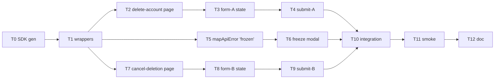

# Tasks: Delete Account & Cancel Deletion UI (spec C)

> **Companions**: [`spec.md`](./spec.md) / [`plan.md`](./plan.md) / [`design/handoff.md`](./design/handoff.md)
> **Status**: PHASE 1 T0-T10 + T12 ✅ shipped 2026-05-07(PR [#78](https://github.com/xiaocaishen-michael/no-vain-years-app/pull/78));PHASE 2 T_mock + T13 + T14 + T15 + T16-doc ✅ shipped 2026-05-07(PR [#79](https://github.com/xiaocaishen-michael/no-vain-years-app/pull/79));**T16-smoke ✅ 2026-05-08(本 PR)**;T11 真后端冒烟 🟡 deferred(等 server release 0.2.0 production deploy)
> **Implementation PR**: PHASE 1 = PR [#78](https://github.com/xiaocaishen-michael/no-vain-years-app/pull/78);PHASE 2 = feature/spec-c-mockup-translation(本会话,见各 task `Commit` 字段;PR # 待 push 后回填)
> **里程碑依赖**(spec C impl session 才开):
>
> - **spec B impl ship**(`account-settings-shell` PR — 提供 `account-security/_layout.tsx` 文件 + spec B FR-011 `useAuthStore.phone` 字段扩展)
> - **spec D server PR ship**(`phone-sms-auth FROZEN → ACCOUNT_IN_FREEZE_PERIOD` 错误码暴露 — 否则 mapApiError 'frozen' 分支无 server 信号,真后端冒烟阻塞)
>
> 上游 ship 后 spec C impl 可独立跑;tasks 内部依赖见各 task `前置` 字段。

---

## 任务列表(共 12 task,预计 1.5-2 work-day)

### T0 ✅ [SDK] `pnpm api:gen` 拉取 spec D ship 后的最新 OpenAPI 生成 SDK

**前置**:spec D server PR ship + production 部署 + `/v3/api-docs` 暴露最新 spec(含 AccountDeletionControllerApi + CancelDeletionControllerApi)

**步骤**:

1. `pnpm api:gen` 跑 OpenAPI generator(per `docs/conventions/api-contract.md` + meta `/sync-api-types`)
2. 验证生成结果:
   - `packages/api-client/src/generated/apis/AccountDeletionControllerApi.ts` 存在 + export `getAccountDeletionApi()` factory
   - `packages/api-client/src/generated/apis/CancelDeletionControllerApi.ts` 存在 + export `getCancelDeletionApi()` factory
   - models:`DeleteAccountRequest` / `SendCancelDeletionCodeRequest` / `CancelDeletionRequest` / `LoginResponse`(后者复用 phone-sms-auth 既有)
3. `packages/api-client/src/index.ts` 检查 re-export(沿用 OpenAPI generator 默认 pattern)

**Verify**:

- `rg "AccountDeletionControllerApi" packages/api-client/src/generated/apis/index.ts`(命中)
- `rg "CancelDeletionControllerApi" packages/api-client/src/generated/apis/index.ts`(命中)
- `rg "DeleteAccountRequest" packages/api-client/src/generated/models/index.ts`(命中)
- `pnpm --filter @nvy/api-client typecheck`(全绿)

**红绿循环**:不适用(自动生成产物)

**Commit**:`chore(api): regenerate SDK for AccountDeletion + CancelDeletion controllers (spec C T0)`

**Aligned FR/SC**:FR-021 / SC-010

---

### T1 ✅ [Auth] `packages/auth` 4 wrapper + 单测

**前置**:T0 完成

**步骤**:

1. 红:`packages/auth/src/usecases.test.ts` 加 4 wrapper 测试用例(模仿既有 `phoneSmsAuth.test.ts` pattern)
   - `requestDeleteAccountSmsCode` happy(204 → resolve void)+ error(429 → throw)
   - `deleteAccount(code)` happy(204 → resolve void + clearSession 调用) + error(401 / 429 → throw + clearSession **未必**调,per finally 块设计)
   - `requestCancelDeletionSmsCode(phone)` happy(200 → resolve void)+ error
   - `cancelDeletion(phone, code)` happy(200 + LoginResponse → setSession + loadProfile)+ error
   - typecheck pass + 测试 RED
2. 绿:`packages/auth/src/usecases.ts` 加 4 wrapper(per plan.md § packages/auth 4 wrapper signature 草稿,逐字按签名实现)→ 测试 GREEN
3. 检查 `packages/auth/src/__mocks__/usecases.ts`(若存在)同步加 4 mock function(per memory `feedback_new_export_grep_mock_factories.md`)
4. typecheck + lint pass:`pnpm --filter @nvy/auth typecheck` + `pnpm --filter @nvy/auth lint`
5. 改 tasks.md:T1 行 `### T1 ✅ [Auth] ...`,加 commit hash 占位
6. `git add` 4 文件 + `git commit`

**Verify**:

- `pnpm --filter @nvy/auth test` 全绿(新增 4 wrapper 单测 + 既有 phoneSmsAuth 测试不破)
- `pnpm --filter @nvy/auth typecheck` 全绿
- `git log -1` 命中 commit message

**Commit**:`feat(auth): add deleteAccount + cancelDeletion + SMS code wrappers (spec C T1)`

**Aligned FR/SC**:FR-004 / SC-001(部分覆盖 wrapper 路径)

---

### T2 ✅ [Page-A] `delete-account.tsx` 占位 page + 伴文件 + Stack.Screen 注册 + 单测

> **Drift note (impl)**: 伴文件实际命名 `delete-account-errors.ts`(原 tasks.md 写 `delete-account.ts` 与 `.tsx` 同名,触发 TS 模块解析 `.ts` 优先 + Expo Router app/ 下 `.ts` 扫描歧义 — 重命名规避)。

**前置**:T1 完成 + spec B impl ship(`account-security/_layout.tsx` 文件存在)

**步骤**:

1. 红:`delete-account.test.tsx` 加 US1 acceptance scenario 1-5 单测(渲染检查:警示文案 + 2 checkbox 未勾态 + 发码 disabled + code input disabled + 提交 disabled + 顶 nav 标题)→ RED
2. 绿:
   - 创建 `apps/native/app/(app)/settings/account-security/delete-account.tsx`(per plan.md UI 段占位结构)— 含 PHASE 1 PLACEHOLDER banner + COPY 常量 + 占位 component(初始 IDLE state,发码 / 提交 disabled);**state machine 转换在 T3 加,本 T2 仅初始 IDLE state 渲染**
   - 创建 `apps/native/app/(app)/settings/account-security/delete-account.ts` 伴文件:`mapDeletionError(e): MappedError`(per plan.md 决策 3 + FR-009);本 T2 写函数 stub 含 4 kind switch + 错误码映射(具体码 → toast 文案)
   - 改 `apps/native/app/(app)/settings/account-security/_layout.tsx`(spec B impl 创建)+ `<Stack.Screen name="delete-account" options={{ title: '注销账号' }} />`
3. typecheck + lint pass
4. 改 tasks.md:T2 ✅
5. `git add` + `git commit`

**Verify**:

- US1 acceptance 单测全绿
- 占位 UI grep:`rg "PHASE 1 PLACEHOLDER" apps/native/app/\(app\)/settings/account-security/delete-account.tsx`(命中)
- `rg "from '@nvy/ui'" apps/native/app/\(app\)/settings/account-security/delete-account.tsx`(0 命中,占位 UI 不引)

**Commit**:`feat(account): add delete-account placeholder page + Stack.Screen registration (spec C T2)`

**Aligned FR/SC**:FR-001 / FR-002 / FR-009 / FR-014 / SC-001(US1)/ SC-005(占位 0 视觉决策)

---

### T3 ✅ [Form-A] delete-account form state machine + 单测

> **Drift note (impl)**: 错误路径单测从 component-level(delete-account.test.tsx)迁移到 helper-level(delete-account-errors.test.ts) — vitest spy-rejection tracker 把 mock 拒绝当成 unhandled rejection 报告(即使 component 用 .then().catch() 拦截),迁到 mapDeletionError 直测覆盖更稳。component 层保留 chained reject→resolve 的 US3-4 retry-clear 验证。

**前置**:T2 完成

**步骤**:

1. 红:`delete-account.test.tsx` 加 US2 acceptance 1-3 单测 + US3 错误容错单测
   - state 转换:IDLE → CHECKBOX_HALF → CHECKBOX_FULL → CODE_SENDING → CODE_SENT → CODE_TYPING → CODE_READY
   - 60s cooldown(useState 倒计时)断言:setInterval mock + advance time
   - 错误展示:msw mock 429 / 401 / 5xx → ErrorRow 文案
   - typecheck pass + RED
2. 绿:
   - `delete-account.tsx` 加 state hooks(`checkbox1` / `checkbox2` / `code` / `hasSentCode` / `cooldown` / `errorMsg`)
   - 双勾 guard:发码按钮 disabled = `!(checkbox1 && checkbox2)`
   - 发码 handler `handleSendCode`:调 `requestDeleteAccountSmsCode()` → 成功启动 60s cooldown(`setInterval` 1s tick)→ 错误调 mapDeletionError 写 errorMsg
   - code input `onChangeText` strip 非数字 + maxLength 6
   - 提交按钮 disabled = `!hasSentCode || code.length !== 6 || isSubmitting`
3. typecheck + lint pass
4. 改 tasks.md:T3 ✅
5. `git add` + `git commit`

**Verify**:

- US2 acceptance 1-3 + US3 acceptance 1-4 单测全绿
- cooldown 测试覆盖:发码成功后 60s 内按钮 disabled;倒计时显示(`60s 后可重发` ... `1s 后可重发`)

**Commit**:`feat(account): wire delete-account form state machine + cooldown + error mapping (spec C T3)`

**Aligned FR/SC**:FR-005 / FR-006 / FR-007 / FR-009 / SC-001(US2-3)

---

### T4 ✅ [Submit-A] delete-account 提交 + clearSession + 跳 (auth)/login + 单测

**前置**:T3 完成

**步骤**:

1. 红:`delete-account.test.tsx` 加 US2 acceptance 4-5 + US9 race guard 单测
   - 提交 happy path:msw mock `POST /accounts/me/deletion` 204 → 断言 deleteAccount 调用 + clearSession 调用 + router.replace '/(auth)/login'
   - race guard:慢响应 mock + 连续两次 tap → API 仅调一次
2. 绿:
   - `handleSubmit` handler:setIsSubmitting(true) → `await deleteAccount(code)` → finally setIsSubmitting(false)
   - 成功 path:`router.replace('/(auth)/login')`(deleteAccount() 内部 finally 已 clearSession,UI 不重复)
   - 失败 path:catch + mapDeletionError + setErrorMsg + form 保持
   - race guard:`<Pressable disabled={isSubmitting}>` + opacity 0.5 + a11y `disabled+busy`
3. typecheck + lint pass
4. 改 tasks.md:T4 ✅
5. `git add` + `git commit`

**Verify**:

- US2 全绿 + US9 race guard 全绿
- SC-001(注销 happy path)+ SC-007(race guard)单测覆盖

**Commit**:`feat(account): wire delete-account submission + clearSession + redirect (spec C T4)`

**Aligned FR/SC**:FR-008 / FR-019 / SC-001(US2 完整)/ SC-007

---

### T5 ✅ [Login-Map] login flow `mapApiError` 加 'frozen' 分支 + 单测

> **Drift note (impl)**: ResponseError body 异步读取需求 → 加 sync `mapApiError(e, bodyCode?)` + async helper `readErrorCode(e)`,caller(`use-login-form.handleApiError`)await body 后传给 sync mapper(避 mapApiError 全函数 async 导致 onboarding.ts 调用面破坏)。`useLoginForm` 加 `showFrozenModal` / `clearFrozenModal` 状态(T6 freeze modal 拼装入口)。

**前置**:T1 完成(packages/auth 4 wrapper 落地;无 spec D 阻塞 — 本 T 是 client 映射逻辑,可基于 mock 跑)

**步骤**:

1. 红:`apps/native/app/(auth)/login.test.tsx`(扩既有)加单测
   - msw mock `POST /api/v1/auth/phone-sms` 返 ACCOUNT_IN_FREEZE_PERIOD 错误响应(假设 spec D 用 403 + `{ code: 'ACCOUNT_IN_FREEZE_PERIOD' }`,实际 spec D ship 后调整)
   - 断言 mapApiError 返 `{ kind: 'frozen', toast: ... }`(per FR-010)
   - 反例:其他错误码(401 / 429 / 500)不返 'frozen' 走原 mapApiError(per US4 acceptance 5)
   - typecheck pass + RED
2. 绿:
   - `apps/native/app/(auth)/login.ts`:扩 `mapApiError` switch 加 `case 'ACCOUNT_IN_FREEZE_PERIOD' → { kind: 'frozen', toast: COPY.frozenDescription }`
   - `apps/native/app/(auth)/use-login-form.ts`:catch 块改:`const mapped = mapApiError(e); if (mapped.kind === 'frozen') setShowFreezeModal(true); else setErrorMessage(mapped.toast);`(showFreezeModal state hook 在 T6 加,本 T5 仅 mapApiError + use-login-form catch 分支)
3. typecheck + lint pass
4. 改 tasks.md:T5 ✅
5. `git add` + `git commit`

**Verify**:

- US4 acceptance 1 + 5 单测覆盖(frozen 分支 + 反例其他错误码不触发)
- mapApiError 'invalid' / 'rate_limit' / 'network' 分支不破(既有测试不破)

**Commit**:`feat(auth): add 'frozen' kind to mapApiError for freeze-period detection (spec C T5)`

**Aligned FR/SC**:FR-010 / SC-003(部分 — modal 触发条件在 T6 完整覆盖)

---

### T6 ✅ [Freeze-Modal] freeze modal 嵌入 `login.tsx` + handlers + 单测

**前置**:T5 完成

**步骤**:

1. 红:`login.test.tsx` 加 US4 acceptance 2-4 + US5 + US6 单测
   - mapApiError 'frozen' → showFreezeModal=true → modal visible
   - tap [撤销] → router.push '/(auth)/cancel-deletion?phone=<encoded>'
   - tap [保持] → showFreezeModal=false + form clear
   - Android back(`onRequestClose`)等价 [保持](per plan 决策 5)
   - typecheck pass + RED
2. 绿:
   - `login.tsx` 加 `useState<boolean>` showFreezeModal hook
   - 文件末尾追加 `<Modal>` JSX(per plan.md UI 段 freeze modal 占位结构)
   - handlers:
     - `handleCancelDelete`:setShowFreezeModal(false) + `router.push('/(auth)/cancel-deletion?phone=' + encodeURIComponent(form.phone))`
     - `handleKeep`:setShowFreezeModal(false) + reset form(react-hook-form `reset()` 或等价 setState 清 phone+code)
   - `<Modal onRequestClose={handleKeep}>` 绑 [保持]
   - 文案在 `const FREEZE_COPY = { ... }` 集中
3. typecheck + lint pass
4. 改 tasks.md:T6 ✅
5. `git add` + `git commit`

**Verify**:

- US4-6 acceptance 全绿
- SC-003 完整(modal 仅 'frozen' 触发,其他错误不触发)

**Commit**:`feat(auth): embed freeze modal in login + cancel/keep handlers (spec C T6)`

**Aligned FR/SC**:FR-011 / FR-012 / SC-003

---

### T7 ✅ [Page-B] `cancel-deletion.tsx` 占位 page + 伴文件 + Stack.Screen 注册 + 单测

> **Drift note (impl)**: 同 T2 — 伴文件 `cancel-deletion-errors.ts`(避 `.ts/.tsx` 模块解析冲突)。`_layout.tsx` 改为显式 Stack(原仅 screenOptions),加 `login` + `cancel-deletion` 两个 Screen 显式 title 注册。

**前置**:T1 完成

**步骤**:

1. 红:`cancel-deletion.test.tsx` 加渲染检查单测
   - 有 phone param(via `useLocalSearchParams` mock):input read-only + maskPhone 显示 + setParams undefined 调用
   - 无 phone param:input editable + 默认 empty
   - 顶 nav 标题"撤销注销"
   - 警示文案渲染
   - typecheck pass + RED
2. 绿:
   - 创建 `apps/native/app/(auth)/cancel-deletion.tsx`(per plan.md UI 段占位结构)— PHASE 1 PLACEHOLDER banner + COPY + 占位 component(初始 state)
   - 实现 mount useEffect 第一动作:读 phone param → 写 state → setParams undefined(per FR-013 + FR-022)
   - 创建 `apps/native/app/(auth)/cancel-deletion.ts` 伴文件:`mapCancelDeletionError(e): MappedError`(本 T 写 stub,具体错误码映射在 T8/T9)
   - 改 `apps/native/app/(auth)/_layout.tsx` 加 `<Stack.Screen name="cancel-deletion" options={{ title: '撤销注销' }} />`
3. typecheck + lint pass
4. 改 tasks.md:T7 ✅
5. `git add` + `git commit`

**Verify**:

- 渲染检查单测全绿
- `rg "router.setParams" apps/native/app/\(auth\)/cancel-deletion.tsx`(命中)
- 占位 UI grep:PHASE 1 banner + 0 packages/ui import

**Commit**:`feat(auth): add cancel-deletion placeholder page + Stack.Screen registration (spec C T7)`

**Aligned FR/SC**:FR-001 / FR-003 / FR-013 / FR-022 / SC-005

---

### T8 ✅ [Form-B] cancel-deletion form state machine + 单测

**前置**:T7 完成

**步骤**:

1. 红:`cancel-deletion.test.tsx` 加 US7 acceptance 2 + US8 单测
   - state 转换(per plan.md state machine):READING_PARAMS → PHONE_PREFILLED / PHONE_EMPTY → PHONE_TYPING(deep link path)→ PHONE_READY → CODE_SENDING → CODE_SENT → CODE_TYPING → CODE_READY
   - 60s cooldown 同 T3
   - 错误展示:msw mock cancel-deletion endpoints 429 / 401 / 5xx → ErrorRow 反枚举文案("凭证或验证码无效")
   - typecheck pass + RED
2. 绿:
   - state hooks:`phone` / `phoneReadOnly` / `code` / `hasSentCode` / `cooldown` / `errorMsg`
   - `handleSendCode` handler:`requestCancelDeletionSmsCode(phone)` → 60s cooldown 启动
   - phone editable / read-only 分支(per CL-003 + FR-013)
   - 反枚举文案:mapCancelDeletionError 各错误码统一 → "凭证或验证码无效"(per FR-020)
3. typecheck + lint pass
4. 改 tasks.md:T8 ✅
5. `git add` + `git commit`

**Verify**:

- US7 acceptance 2 + US8 全绿
- SC-008 反枚举:grep cancel-deletion.tsx 不出现"phone 未注册" / "已匿名化" 等细分文案

**Commit**:`feat(auth): wire cancel-deletion form state machine + cooldown + error mapping (spec C T8)`

**Aligned FR/SC**:FR-006 / FR-007 / FR-009 / FR-013 / FR-020 / SC-008

---

### T9 ✅ [Submit-B] cancel-deletion 提交 + setSession + loadProfile + 跳 (app) + 单测

**前置**:T8 完成

**步骤**:

1. 红:`cancel-deletion.test.tsx` 加 US7 acceptance 3-4 + US9 race guard 单测
   - 提交 happy path:msw mock `POST /auth/cancel-deletion` 200 + LoginResponse → 断言 cancelDeletion 调用 + setSession 调用 + loadProfile 调用 + router.replace '/(app)/(tabs)'
   - 顺序断言:setSession 先 → loadProfile 后 → router.replace 最后
   - race guard:同 T4
2. 绿:
   - `handleSubmit` handler:setIsSubmitting(true) → `await cancelDeletion(phone, code)` → finally setIsSubmitting(false)
   - 成功 path:`router.replace('/(app)/(tabs)')`(cancelDeletion() 内部已 setSession + loadProfile,UI 不重复)
   - 失败 path:catch + mapCancelDeletionError + setErrorMsg
   - race guard:同 T4 pattern
3. typecheck + lint pass
4. 改 tasks.md:T9 ✅
5. `git add` + `git commit`

**Verify**:

- US7 全绿 + US9 race guard cancel-deletion path 全绿
- SC-004(cancel-deletion happy)+ SC-007(race guard)

**Commit**:`feat(auth): wire cancel-deletion submission + setSession + redirect home (spec C T9)`

**Aligned FR/SC**:FR-019 / SC-004 / SC-007

---

### T10 ✅ [Integration] 跨 component 集成测(login flow → modal → cancel-deletion → home)

**前置**:T2-T9 完成

**步骤**:

1. 红:新增 `apps/native/app/__tests__/freeze-flow-integration.test.tsx`(或扩既有 integration 测试目录)
   - 完整路径单测:
     - 渲染 `(auth)/login` → fireEvent 输 phone+code → tap 登录 → mock server 返 ACCOUNT_IN_FREEZE_PERIOD → freeze modal visible → tap [撤销] → router.push assert 调用 → 渲染 cancel-deletion(预填 phone read-only)→ tap 发码 → 输 code → tap 撤销注销 → mock server 返 200 + LoginResponse → assert setSession + loadProfile + router.replace '/(app)/(tabs)'
   - phone 跨 screen 传递断言:cancel-deletion 收到正确 phone(via router param)+ setParams undefined 后 URL 不再含 phone
   - 单元测 RED
2. 绿:T2-T9 已落地实现,集成测应自然 GREEN(若不绿,定位 component 间接口契约不匹配处)
3. typecheck + lint pass
4. 改 tasks.md:T10 ✅
5. `git add` + `git commit`

**Verify**:

- 集成测全绿
- SC-002(完整 freeze 流路径)+ SC-009(A→B→C 链路联通,但 B 已 ship 是前置)

**Commit**:`test(auth): add freeze-flow integration test (login → modal → cancel-deletion → home) (spec C T10)`

**Aligned FR/SC**:SC-002 / SC-009

---

### T11 🟡 [Smoke] 真后端冒烟 + 截图归档(post-merge deferred)

> **Deferral reason**: 前置 "spec D server production deploy" 未满足 — server 仓 release PR #40(release 0.2.0)仍 OPEN(`autorelease: pending`),production 部署的仍是 v0.1.0(无 ACCOUNT_IN_FREEZE_PERIOD 错误码)。本 impl PR 走 `pnpm api:gen:dev`(localhost spec)生成 SDK,T10 集成测合同性覆盖完整 freeze flow。T11 真后端冒烟应在以下条件满足后跑:
>
> 1. server release PR #40 merged + Deploy workflow 绿
> 2. production `/v3/api-docs` 含两 deletion controller + ACCOUNT_IN_FREEZE_PERIOD 错误码可触发
> 3. 测试账号准备(phone Y → register / phone X → 注销发起后 FROZEN)
>
> 完成后回填本 task 为 ✅ + 截图归档路径(`runtime-debug/<date>-delete-account-cancel-deletion-business-flow/`)。

**前置**:T10 完成 + spec D server 已 production deploy + spec B impl 已 ship + 测试账号准备(测试账号 phone + 提前在 Postman / 等价工具 trigger 注销 → FROZEN 状态)

**步骤**:

1. 准备测试账号:用注册 + 注销发起将 phone X 转 FROZEN 状态(server 端 deletion 后 status==FROZEN)
2. 跑 Playwright(RN Web bundle):
   - 路径 1(发起注销):登录 phone Y → 进 settings → tap 注销账号 → 双勾 → 发码 → 输 code → 提交 → 跳 login screen
   - 路径 2(撤销注销):login 输 phone X + 任意 code → 提交 → freeze modal 触发 → tap [撤销] → cancel-deletion 预填 phone → 发码 → 输 code → tap 撤销 → 跳 home
3. 截图归档:
   - `runtime-debug/2026-05-XX-delete-account-cancel-deletion-business-flow/`
   - 关键 step 截图(login screen / modal / cancel-deletion / home)各 1 张
4. 改 tasks.md:T11 ✅
5. `git add` + `git commit`(若有 Playwright config 改 / 测试用例改,否则 commit message 仅 docs)

**Verify**:

- 两条路径 manual review 通过
- SC-006(真后端冒烟)+ SC-009(链路联通)

**Commit**:`test(auth): smoke test delete-account + cancel-deletion business flow (spec C T11)`

**Aligned FR/SC**:SC-006 / SC-009

---

### T12 ✅ [Doc] tasks.md 自勾 ✅ + PR ref + plan-lifecycle 归档

**前置**:T0-T11 完成 + PR opened

**步骤**:

1. 改本 `tasks.md`:T0-T11 全部加 `✅` + 各 commit hash 占位补完(如 `### T0 ✅ [SDK] (commit abc1234)`)
2. 改 docs/plans/spec-c-delete-account-cancel-deletion-u-zany-giraffe.md(meta 仓):
   - 状态 `pending` → `archived`
   - 移到 `docs/plans/archive/26-05/`(per plan-lifecycle convention)
3. 加 PR ref:tasks.md 顶部加 `> **Implementation PR**: #<PR-num>`
4. `git add` + `git commit`

**Verify**:

- `rg "✅" apps/native/spec/delete-account-cancel-deletion-ui/tasks.md | wc -l` ≥ 11(T0-T11 + T12 自身)
- `ls docs/plans/spec-c-*` (meta 仓)0 命中
- `ls docs/plans/archive/26-05/spec-c-*` 命中

**Commit**:`docs(account): close spec C tasks + archive plan file (spec C T12)`

**Aligned FR/SC**:无(纯 doc 归档 task)

---

## Mockup PHASE 2 阶段(本 PR — UI 翻译落地)

> 本段沿用 onboarding(T_mock/T8-T11)/ my-profile(T_mock/T10-T13)/ account-settings-shell(T_mock/T12-T15)PHASE 2 五任务模式。详细 mockup 决策见 [`design/handoff.md`](./design/handoff.md)。
>
> **顺序**:T_mock(bundle 落 + handoff 文档)→ T13(delete-account 翻译)→ T14(cancel-deletion 翻译)→ T15(login.tsx freeze modal 翻译)→ T16(plan.md UI 段回填 + visual smoke + 全 ✅)

---

### T_mock ✅ [Mockup] bundle 落 `design/source/` + 写 `design/handoff.md` 7 段

**前置**:Claude Design 跑完 mockup(用户本地 `~/Downloads/account-center/`)

**步骤**:

1. `cp -r ~/Downloads/account-center/. apps/native/spec/delete-account-cancel-deletion-ui/design/source/`
2. 写 `design/handoff.md` 7 段(per `<meta>/docs/experience/claude-design-handoff.md` § 5 模板,沿用 account-settings-shell handoff 结构):
   - § 1 Bundle 内容速览 + 丢弃同源 spec 文件清单 + deliverable 命名 drift 说明
   - § 2 9 个 inline component breakdown(0 抽 packages/ui 决策 + 触发 promote 条件)
   - § 3 6 状态机 ↔ spec FR/SC 对齐(6/6 完全 match)
   - § 4 Token 决策(+1 modal-overlay,可能 +1 shadow.modal)
   - § 5 翻译期 5+12 条 gotcha audit
   - § 6 Drift 政策(code > mockup)
   - § 7 引用
3. 改本 tasks.md:T_mock ✅(本 task) + 顶部 Status 行同步 PHASE 2 启动
4. `git add` design/source/ + design/handoff.md + tasks.md + `git commit`

**Verify**:

- `ls apps/native/spec/delete-account-cancel-deletion-ui/design/source/project/` 含 `DeleteCancel Preview.html` + `tailwind.config.js` + `IOSFrame.tsx` + `preview/` ✓
- `wc -l apps/native/spec/delete-account-cancel-deletion-ui/design/handoff.md` ≥ 100 行 ✓
- `rg "PHASE 2 T_mock ✅" apps/native/spec/delete-account-cancel-deletion-ui/tasks.md` 命中 ✓

**Commit**:`docs(account): spec C delete-cancel mockup bundle + handoff (M1.X / spec C T_mock)`

**Aligned FR/SC**:无(纯 doc + bundle 归档 task)

---

### T13 ✅ [App] 翻译 `delete-account.tsx` — destructive 注销 page UI 完成

**前置**:T_mock 完成 + design-tokens 加 `modal-overlay`(若 shadow.modal 也缺则一并加)

**步骤**:

1. 改 `packages/design-tokens/src/index.ts` + `apps/native/tailwind.config.ts`:加 `color.modal-overlay = 'rgba(15,18,28,0.48)'`(+ `shadow.modal` 若 account-settings-shell base 未含)
2. 红:`delete-account.test.tsx` 加 PHASE 2 视觉断言:
   - 警示卡 err-soft className 命中
   - 双 checkbox 真控件(`<Pressable accessibilityRole="checkbox">` + `<Text>✓</Text>` filled 态)
   - SendCodeRow 3 态 className 切换(default brand-text / cooldown ink-muted / disabled ink-subtle)
   - CodeInput 6 cell 渲染 + brand ring(focused)/ err ring(errorMsg !== null)联动
   - PrimaryButton destructive(err fill + cta-shadow + disabled 灰)
   - PHASE 1 banner `// PHASE 1 PLACEHOLDER` 已删除
3. 绿:改写 `apps/native/app/(app)/settings/account-security/delete-account.tsx`(per handoff.md § 2 + plan.md UI 段 PHASE 2 回填):
   - 删 PHASE 1 PLACEHOLDER banner
   - 9 inline components(按 handoff § 2 拆解)
   - className 全部走 token(无 hex / rgb / px,layout 维度豁免 — height/width/borderRadius numeric per § 5.1)
   - PHASE 1 hook + state machine + a11y **完整保留**
4. typecheck + lint + test pass
5. 改 tasks.md:T13 行 heading 加 ✅
6. `git add` + `git commit`

**Verify**:

- `pnpm --filter native test apps/native/app/\(app\)/settings/account-security/delete-account.test.tsx` 全绿
- `rg "PHASE 1 PLACEHOLDER" apps/native/app/\(app\)/settings/account-security/delete-account.tsx` 0 命中 ✓
- `rg "#[0-9a-fA-F]{3,8}|rgb\(|[0-9]+px" apps/native/app/\(app\)/settings/account-security/delete-account.tsx` 0 命中(layout 数值 number-only 豁免)
- PHASE 1 既有 acceptance 测试不破

**Commit**:`feat(account): delete-account PHASE 2 mockup translation (M1.X / spec C T13)`

**Aligned FR/SC**:FR-001 / FR-002 / FR-005 / FR-009 / SC-001(US1-3 视觉)/ SC-005(占位 → token 完整)

---

### T14 ✅ [App] 翻译 `cancel-deletion.tsx` — recover 撤销 page UI 完成(brand vs T13 destructive 对比)

**前置**:T13 完成

**步骤**:

1. 红:`cancel-deletion.test.tsx` 加 PHASE 2 视觉断言:
   - 顶部 brand-soft accent bar 渲染 + `恢复账号` heading 命中
   - PhoneInputBlock prefilled 态:`accessibilityState.disabled=true` + maskPhone 文本 + 🔒 icon visible(role="image" or aria-hidden)
   - PhoneInputBlock editable 态:`editable=true` + placeholder 文本
   - SendCodeRow + CodeInput 复用 T13 同结构(本地 inline copy)
   - PrimaryButton brand fill(`bg-brand-500` + `shadow-cta`)— 与 T13 destructive 对比
   - 反枚举守则:`getByText('凭证或验证码无效')` 单一文案命中 + 不出现 `phone 未注册` / `已匿名化` 等
   - PHASE 1 banner 已删除
2. 绿:改写 `apps/native/app/(auth)/cancel-deletion.tsx`(per handoff.md § 2 + plan.md UI 段)
3. typecheck + lint + test pass
4. 改 tasks.md:T14 ✅
5. `git add` + `git commit`

**Verify**:

- `pnpm --filter native test apps/native/app/\(auth\)/cancel-deletion.test.tsx` 全绿
- `rg "PHASE 1 PLACEHOLDER" apps/native/app/\(auth\)/cancel-deletion.tsx` 0 命中 ✓
- `rg "#[0-9a-fA-F]{3,8}|rgb\(|[0-9]+px" apps/native/app/\(auth\)/cancel-deletion.tsx` 0 命中(layout 豁免)
- 反枚举不变性 grep:`rg "phone 未注册|已匿名化|账号不存在" apps/native/app/\(auth\)/cancel-deletion.tsx` 0 命中

**Commit**:`feat(account): cancel-deletion PHASE 2 mockup translation (M1.X / spec C T14)`

**Aligned FR/SC**:FR-003 / FR-013 / FR-019 / FR-020 / SC-004 / SC-005 / SC-008(反枚举)

---

### T15 ✅ [App] freeze modal 嵌入既有 `login.tsx` — overlay + card + 双 button(login form 不动)

**前置**:T14 完成

**步骤**:

1. 红:`login.test.tsx` 加 freeze modal PHASE 2 视觉断言(扩既有 US4-6 测试):
   - showFreezeModal=true 时 modal scrim `bg-modal-overlay` 命中
   - card w296 + rounded-md(16) + shadow-modal 命中
   - 双 button:[保持] ghost(border-line + ink-muted text)/ [撤销] brand fill(bg-brand-500 + shadow-cta)
   - warn icon-circle(warn-soft bg + warn fg)visible
   - 顺序:[保持] 在左 / [撤销] 在右(per mockup primary 在右惯例)
2. 绿:改写 `apps/native/app/(auth)/login.tsx` 末端 freeze modal section(per handoff.md § 2 + plan.md UI 段):
   - **login form 不动**(login v2 PHASE 2 已 ship in PR #51)
   - 替换既有 `<Modal>` body(PHASE 1 占位结构)为 PHASE 2 视觉 — overlay scrim + FreezeModalCard inline
   - showFreezeModal / handleCancelDelete / handleKeep handlers **完整保留**(PHASE 1 T6 ship)
3. typecheck + lint + test pass
4. 改 tasks.md:T15 ✅
5. `git add` + `git commit`

**Verify**:

- `pnpm --filter native test apps/native/app/\(auth\)/login.test.tsx` 全绿
- login v2 form a11y / 视觉 PHASE 2 既有不破:`git diff PR-51..HEAD -- apps/native/app/\(auth\)/login.tsx | grep "^-" | head` 仅在 modal section 有删除(form 段 0 删)
- modal-overlay token 引用:`rg "modal-overlay|modal-overlay" apps/native/app/\(auth\)/login.tsx` 命中

**Commit**:`feat(account): freeze modal PHASE 2 mockup translation in login (M1.X / spec C T15)`

**Aligned FR/SC**:FR-010 / FR-011 / FR-012 / SC-003 / SC-005

---

### T16-doc ✅ [Plan + Doc] plan.md UI 段 PHASE 2 回填 + tasks.md 全 ✅

**前置**:T13/T14/T15 完成

**步骤**:

1. 改 `apps/native/spec/delete-account-cancel-deletion-ui/plan.md` § UI 段:
   - heading `## UI 段(占位版,pending mockup)` → `## UI 段(PHASE 2 mockup 翻译落地)`
   - 删 PHASE 1 4 边界占位代码示意(line 442-650 整段),替换为 PHASE 2 完整版(token 映射表 + 各 page 区域 className 主轴 + 测试 mock 兼容性 + layout 维度白名单 + 引用 handoff.md)
2. 写 `apps/native/runtime-debug/2026-05-07-delete-cancel-mockup-translation/README.md`(占位 — visual smoke 跑法 + 6 状态清单 + future stack-up 步骤)
3. 改本 tasks.md:T16-doc ✅(本 task) + 顶部 Status 行 PHASE 2 全 ✅(T_mock/T13/T14/T15/T16-doc)+ T11 / T16-smoke 🟡 deferred
4. typecheck + lint + test pass(已由 T13/T14/T15 闭环 264/264 验证;T16-doc 仅改 plan.md / tasks.md / runtime-debug README,无业务代码改动)
5. `git add` + `git commit`

**Verify**:

- `rg "PHASE 1 占位版" apps/native/spec/delete-account-cancel-deletion-ui/plan.md` 0 命中(已替换为 PHASE 2 完整版)
- `rg "✅" apps/native/spec/delete-account-cancel-deletion-ui/tasks.md | wc -l` ≥ 16(T0-T10 + T12 + T_mock + T13/T14/T15/T16-doc = 16,T11 + T16-smoke 仍 🟡)
- spec C plan-lifecycle:本 PHASE 2 PR 不动 archive 状态,等 T11 + T16-smoke 闭环后再归档(per memory `feedback_conventions_evergreen_only.md`:plan-lifecycle 操作不必每 phase 都做)

**Commit**:`docs(account): plan UI 段 PHASE 2 回填 + tasks ✅ (spec C T16-doc)`

**Aligned FR/SC**:无(纯 plan 回填 task)

---

### T16-smoke ✅ [Visual smoke] 6 状态截图 + run.mjs

**前置**:T16-doc 完成 + metro :8081(server / docker 不必起,run.mjs 全 mock-based + localStorage inject)

**完成笔记**(2026-05-08):

1. 写 `apps/native/runtime-debug/2026-05-07-delete-cancel-mockup-translation/run.mjs`(mock-based + Phase A 走 SPA 内部 nav 避 setParams race + Phase B 用 `localStorage.setItem('nvy-auth', ...)` inject 绕过 login)
2. 跑 Playwright headless chromium → 6 PNG 落地 + 0 pageErrors / 0 consoleErrors / 0 networkFails
3. **State 03 替代决策**(实测必然):原 spec submit-error 路径不可达 — `deleteAccount()` 无条件 finally `clearSession` → AuthGate 同 React commit 内 `router.replace('/(auth)/login')` → DeleteAccountScreen 在 ErrorRow 第一次 paint 之前就 unmount。Playwright 4 种 capture 策略(default polling / raf polling / 50ms multi-probe / history block)实证全失败。替代:用 send-code 429 rate-limit 错误路径(无 clearSession 副作用)→ 同 ErrorRow + 同 CodeInput err 红 ring 视觉,差异在 ErrorRow 文案(`操作太频繁` vs `验证码错误`)+ SubmitButton disabled vs active。submit-error 视觉差异由 component-level 单测 `delete-account-errors.test.ts` 'invalid_code' 分支补齐。详见 `runtime-debug/2026-05-07-delete-cancel-mockup-translation/README.md` § State 03 替代说明
4. README 同步更新:状态 ✅ + 替代说明 7 段 + 用法 + 状态构造策略

**Verify**:

- `ls apps/native/runtime-debug/2026-05-07-delete-cancel-mockup-translation/*.png | wc -l` == 6 ✓
- 6 PNG 视觉态对齐 mockup(handoff.md § 3 ↔ FR/SC 表)— 01/02/04/05/06 严格对齐;03 spec 替代+文档说明
- `rg "✅" apps/native/spec/delete-account-cancel-deletion-ui/tasks.md` 加 1 (T16-smoke ✅) ✓

**Commit**:`test(account): delete-cancel visual smoke 6 状态 (spec C T16-smoke)`

**Aligned FR/SC**:SC-005(占位 → token 完整 视觉冒烟)/ SC-009(链路联通)

---

## 任务依赖图

**关键路径**:T0 → T1 → (T2/T5/T7 并行) → (T3/T6/T8) → (T4/T9) → T10 → T11 → T12

**实际可并行**:T5+T6 与 T7+T8+T9 与 T2+T3+T4 互不阻塞(分支不同),理论可三轨道并行(单人开发不并行,顺序跑减少分支切换)

---

## 测试策略一览

| 类别                | 覆盖 task     | 工具                | 通过判据                             |
| ------------------- | ------------- | ------------------- | ------------------------------------ |
| Wrapper 单测        | T1            | vitest + msw        | 4 wrapper happy + error path 全绿    |
| Form 状态机单测     | T2-T4 / T7-T9 | vitest + RTL        | US1-3 / US7-8 acceptance 全绿        |
| Login flow 扩展单测 | T5-T6         | vitest + RTL        | US4-6 acceptance 全绿                |
| 集成测              | T10           | vitest + RTL + msw  | freeze flow 端到端单测全绿           |
| 真后端冒烟          | T11           | Playwright (RN Web) | 两条路径 manual review + 截图归档    |
| 反枚举不变性        | T8 + grep     | bash grep           | cancel-deletion 不出现细分文案       |
| 占位 UI 0 视觉决策  | T2/T7 + grep  | bash grep           | 3 文件不含 hex / px / @nvy/ui import |

---

## 启动检查清单

impl session 开始前 user 自查:

- [ ] spec D server PR 已 ship + 部署 production(`/v3/api-docs` 含两 controller)
- [ ] spec B impl PR 已 ship(`account-security/_layout.tsx` + `index.tsx` + `useAuthStore.phone` 已落地)
- [ ] spec C 三件套(spec.md / plan.md / tasks.md)已 PR + merge 进 main(本 docs PR)
- [ ] 测试账号 phone Y 准备(注销发起测试用)+ 测试账号 phone X 准备(冻结期撤销测试用,提前 trigger 注销)
- [ ] `pnpm install` + 当前 main 同步:`git pull origin main` + `pnpm install` 全绿

全 ✅ 后开 impl session,从 T0 开始顺序跑。
