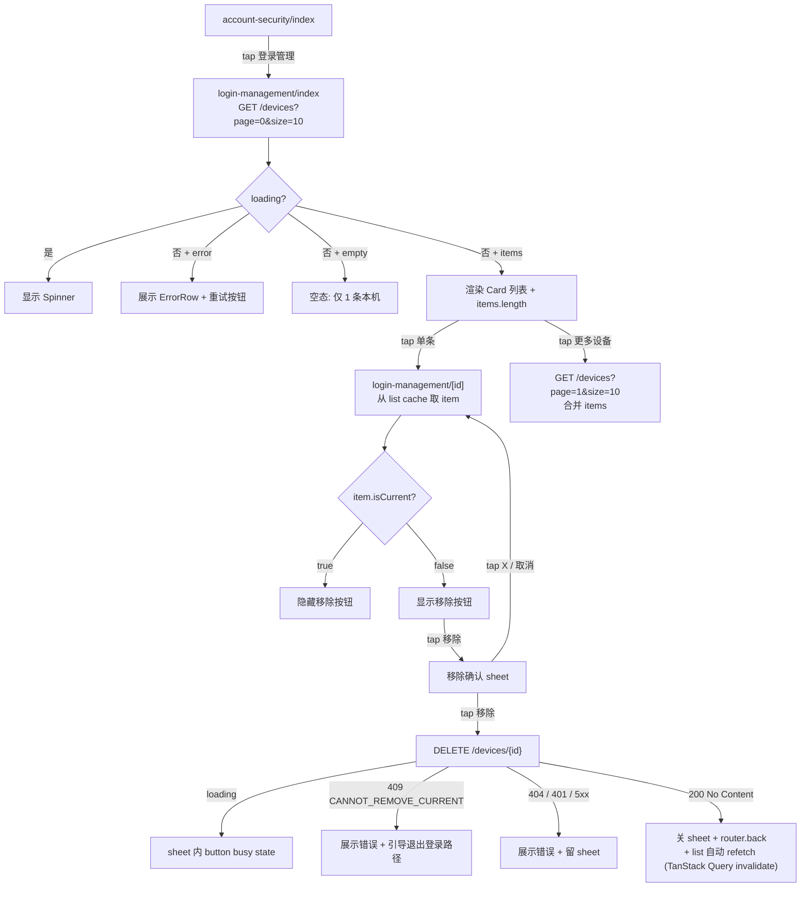

# Feature Specification: Device Management UI（登录管理 — list + detail + 移除）

**Feature Branch**: `feature/device-management`
**Created**: 2026-05-08（per [ADR-0017](../../../../docs/adr/0017-sdd-business-flow-first-then-mockup.md) **类 2 流程变体** — mockup 截图已由用户提供作 IA 锚点；本 spec 后置 design/ + plan UI 段，不走类 1 占位先行）
**Status**: Draft（pending mockup → /speckit.plan + tasks）
**Module**: `apps/native/app/(app)/settings/account-security/login-management/*`（新增 nested route group:list + detail）+ `account-security/index.tsx`（既有，改 row label + 启用 onPress）+ `packages/auth/src/usecases.ts`（既有，扩 device header 上报 + 新增 listDevices / revokeDevice wrapper）+ `packages/api-client/src/generated/`（OpenAPI 重新生成后落 DeviceManagementControllerApi）
**Input**: User description: "从『设置 → 账号与安全 → 登录管理』进入。1)登录管理 list 页:已登录的设备 N + 列表(图标+设备名+本机标+时间+地点)+ 分页;2)登录设备详情:设备名/地点/登录方式/最近活跃 + 移除按钮(本机隐藏);3)点移除弹底部 sheet,取消留页 / 确认 revoke + 回 list。"

> **Context**：[PRD § 5.4 强制退出其他设备](https://github.com/xiaocaishen-michael/no-vain-years/blob/main/docs/requirement/account-center.v2.md#54-强制退出其他设备) 描述「账号安全 - 登录设备」概念。本 spec 是 [`my-beloved-server/spec/account/device-management/spec.md`](https://github.com/xiaocaishen-michael/my-beloved-server/blob/feature/device-management/spec/account/device-management/spec.md) 的前端配套，后端契约 = `GET /api/v1/auth/devices` + `DELETE /api/v1/auth/devices/{recordId}` + `X-Device-Id` / `X-Device-Name` / `X-Device-Type` 上报 header。
>
> **决策约束**：
>
> - **per [ADR-0017](../../../../docs/adr/0017-sdd-business-flow-first-then-mockup.md) 类 2 变体流程**：用户已提供 3 张参考截图（list / detail / sheet）作为 mockup 输入；本 spec **不走类 1 业务流先行 + 占位 UI**，直接 spec → mockup design 翻译 → plan 含完整 UI 段 → tasks → impl
> - 本 spec 阶段产出 **业务流 + 字段契约 + 状态机**；视觉决策（precise px / hex / 阴影 / sheet 库选型 / 本机徽标视觉 / device 图标 SVG / 分页 cta 文案）→ 落 `design/`（用户跑 Claude Design 出项目自身视觉系统）后回填 plan.md UI 段
> - **后端契约假设**（与 server spec 联动 ship，本 spec **不**独立 mock）：
>   - `GET /api/v1/auth/devices?page&size` → `{ items: DeviceItem[], page, size, totalElements, totalPages }`，items 排序 lastActiveAt DESC
>   - `DELETE /api/v1/auth/devices/{recordId}` → 200 No Content（幂等）
>   - `DeviceItem`：`{ id, deviceId, deviceName, deviceType, location, loginMethod, lastActiveAt, isCurrent }`（per server spec CL-002 决议，**不暴 raw ipAddress**，仅 location 中文省市）
> - **OpenAPI 同步前置**：server spec ship 后必跑 `pnpm api:gen` 拉新 OpenAPI 重生 `DeviceManagementControllerApi`；本 spec impl T0 必先做
> - **JWT access token 多 `did` claim**：server spec FR-008 决策；client 升级到本版本后旧 access token 调 device-management endpoint 直接 401，强制 client 重 login 拿新 token（接受过渡期一次重 login 代价）
> - **device_id 持久化**：client 首次启动生成 UUID v4 写 `expo-secure-store`（per app CLAUDE.md § token 安全纪律延伸），登录 / refresh / cancel-deletion 等所有签 token 路径上报 `X-Device-Id` header
> - **本机识别**：信任 server response 的 `isCurrent` 字段（server 通过 access token did claim 标记），client 不做二次比对
> - **入口 row 改名**：`account-security/index.tsx` 内 row label `登录设备与授权管理` → `登录管理`，disabled → 启用 + onPress 跳 `/(app)/settings/account-security/login-management`
> - **packages/auth 新增 2 wrapper**：`listDevices(page, size) -> DeviceListResult` / `revokeDevice(recordId) -> void`；header 上报由 `packages/api-client` 中间件统一注入（不让每个 wrapper 手填）

## Visual References

3 张用户提供的参考截图（来源：用户业务设计稿，非外部品牌）作为 IA + 字段 + 交互锚点：

| 图  | 文件（mockup 阶段归档到 `design/inspiration/`） | 角色                                                                                                                      | 本 spec 引用              |
| --- | ----------------------------------------------- | ------------------------------------------------------------------------------------------------------------------------- | ------------------------- |
| 1   | `01-list.png`                                   | list 页 IA：标题 / 副标题计数 / Card 列表 / 设备图标 + 名 + 本机徽标 + 时间 + 地点 + chevron / 「更多设备」分页 cta       | **本 spec list 主参照**   |
| 2   | `02-detail.png`                                 | detail 页 IA：4 字段（设备名称 / 登录地点 / 登录方式 / 最近活跃）+ 底部全宽「移除该设备」CTA（本机隐藏）                  | **本 spec detail 主参照** |
| 3   | `03-sheet.png`                                  | 移除确认底 sheet：标题「移除设备」+ 描述「移除设备后,该设备再次登录需要重新安全验证」+ 取消（白底）/ 移除（红底）+ 右上 ✕ | **本 spec sheet 主参照**  |

设计风格参考：用户提供截图（个人项目 mockup 来源），仅作 layout / IA / 信息层级参照；PHASE 2 mockup 阶段产出本项目自身视觉系统（tokens / spacing / 字号 / 颜色全部走 `@nvy/design-tokens`，不引用截图原色）。

## Information Architecture

```mermaid
flowchart TB
    subgraph B_Spec["(app)/settings/account-security (spec B — 已 ship)"]
        AS1["account-security/index.tsx"]
    end

    subgraph C_Spec["spec device-management — 本 spec"]
        LM_LIST["login-management/index.tsx<br/>list (图标+名+本机+时间+地点)"]
        LM_DETAIL["login-management/[id].tsx<br/>详情 (4 字段+移除 CTA)"]
        LM_SHEET["移除确认 bottom sheet<br/>(取消/移除)"]
    end

    AS1 -->|tap 登录管理 (改名 + 启用)| LM_LIST
    LM_LIST -->|tap 单条 (含本机)| LM_DETAIL
    LM_DETAIL -->|tap 移除 (本机不显示按钮)| LM_SHEET
    LM_SHEET -->|tap 取消 / X| LM_DETAIL
    LM_SHEET -->|tap 移除 + DELETE 200| LM_LIST
```

## User Flow



## Clarifications

> 6 个核心决策点已在用户 Q1-Q6 + server spec Context 段固化；本 spec 不重列。剩余 UI 维度澄清如下，部分待 mockup 阶段 / plan 阶段二次拍板。

### CL-001 — bottom sheet 库选型（待 mockup 决）

**Q**：移除确认 sheet（图 3）用什么实现？候选：

- (a) `@gorhom/bottom-sheet`（社区主流，跨端 — RN-Web 兼容性 OK，已 NativeWind v4 案例）
- (b) RN 内置 `Modal` + 自定义底部对齐 + 手势退出（无新依赖，但手势 / 滑动手感差）
- (c) 自封一个 `<BottomSheet>` 组件进 `packages/ui`（PHASE 2 mockup 设计 token 后做）

**推荐**：留 mockup 阶段拍 — 若 mockup 标 sheet 含拖拽手势 / spring 弹性动画 → (a)；若仅静态弹出 → (b) 简化。**plan.md UI 段回填**。

### CL-002 — list 分页 cta 形态（待 mockup 决）

**Q**：用户 Q3 决议"保留分页默认 8-10 条"。截图 1 末尾"更多设备 >" 是 inline 链接形态。候选：

- (a) inline 链接（截图风格）— tap 加载 page+1 + append items
- (b) 标准 infinite scroll（无 cta 按钮，触底自动加载）— UX 更现代
- (c) 数字分页器（page 1 / 2 / 3）— 截图无此形态，弃

**推荐**：(a)（贴截图）；mockup 阶段确认是否需要 (b) 升级。

### CL-003 — login_method 文案翻译

**Q**：server `loginMethod` enum → UI 中文文案？

| enum 值     | 推荐文案                    |
| ----------- | --------------------------- |
| `PHONE_SMS` | 快速登录（per 截图 2 字段） |
| `GOOGLE`    | Google 登录                 |
| `APPLE`     | Apple 登录                  |
| `WECHAT`    | 微信登录                    |

**落点**：FR-009 翻译表；M2+ Google/Apple/微信接入时再校对文案。

### CL-004 — device_type 图标映射

**Q**：server `deviceType` enum → 图标？

| enum 值           | 图标语义（具体 SVG 落 mockup）  |
| ----------------- | ------------------------------- |
| `PHONE`           | 手机 outline（截图 1 第一行）   |
| `TABLET`          | 平板 outline                    |
| `DESKTOP` / `WEB` | 显示器 outline（截图 1 第二行） |
| `UNKNOWN`         | 通用设备 outline 兜底           |

**落点**：plan.md UI 段；SVG 实现走 `react-native-svg` 同 `(tabs)/_layout.tsx` 既有 IconHome / IconUser 风格。

### CL-005 — 分页时本机标记可见性

**Q**：server spec User Story 1 acceptance 5 描述：当前 device 在 page=1 时，page=0 渲染**无**本机徽标，client 翻到 page=1 才看到。是否需要 client 端 hack（GET 第 1 页时也拿本机所在 page 一并 prefetch + 头部置顶本机条目）？

**推荐**：**不 hack，保持 server 决定排序**（lastActiveAt DESC）。理由：

- 本机大概率是最新活跃（刚登录 / 刚刷新 token），自然位于 page=0 头部
- hack "本机置顶"会与 lastActiveAt DESC 排序冲突，UX 上 list 顺序不稳定
- 极端情况（本机长时间未刷新被挤到 page=2）属于不可达

**落点**：FR-006 不做置顶 hack。

## Functional Requirements

### Entry & Routing

- **FR-001（入口改名 + 启用）**：`apps/native/app/(app)/settings/account-security/index.tsx` 改：
  - row label `登录设备与授权管理` → `登录管理`
  - 移除 `disabled` prop
  - 加 `onPress={() => router.push('/(app)/settings/account-security/login-management')}`
- **FR-002（路由结构）**：新建 nested folder 与 expo-router dynamic segment：
  - `app/(app)/settings/account-security/login-management/_layout.tsx`：Stack screen options（`{ title: '登录管理' }`）
  - `app/(app)/settings/account-security/login-management/index.tsx`：list 页
  - `app/(app)/settings/account-security/login-management/[id].tsx`：detail 页（动态路由，从 list 跳入时 push 带 id 参数）
- **FR-003（detail 数据来源）**：detail 页**不**调单独 GET /devices/{id}（server 无此 endpoint）；从 list response cache（TanStack Query `useQuery` key=`['devices', page]`）按 id 查找；缓存 miss → 回退到 GET /devices?page=0 + retry 查找；仍 miss → 显示 "设备不存在" 错误页 + 返回 cta

### List Page

- **FR-004（list 数据请求）**：mount 时调 `useDevicesQuery(page=0, size=10)`（封装 TanStack Query），key=`['devices', page]`；显示 loading spinner / error / items / empty 四态
- **FR-005（list 渲染）**：
  - 顶部副标题 `已登录的设备 {totalElements}`（per 截图 1）
  - Card 内每条 row：device 图标 + deviceName + 本机徽标（item.isCurrent === true 时显示）+ lastActiveAt 格式化（"YYYY.MM.DD HH:mm" per 截图 1，**不**精确到秒，per 截图）+ location（"上海"，null → "—"）+ 右 chevron
  - tap row → router.push `/(app)/settings/account-security/login-management/[item.id]`（id 是 server 的 RefreshTokenRecord id，不是 deviceId）
- **FR-006（list 分页）**：items.length < totalElements 时末尾渲染 inline cta `更多设备 >`，tap 后 fetch page+1 + 合并 items（不替换）；page>=totalPages 时不显示 cta
- **FR-007（错误态）**：网络错 / 401 → ErrorRow + 重试按钮；401 同时触发 store.clearSession + router.replace `/(auth)/login`（既有 401-refresh 中间件兜底）

### Detail Page

- **FR-008（detail 字段渲染）**（per 截图 2）：
  - 设备名称（item.deviceName）
  - 登录地点（item.location，null → "—"）
  - 登录方式（item.loginMethod 经 CL-003 翻译表）
  - 最近活跃（item.lastActiveAt 格式化"YYYY.MM.DD HH:mm:ss"，detail 页**精确到秒** per 截图 2）
- **FR-009（移除按钮可见性）**：item.isCurrent === true → 隐藏「移除该设备」CTA（per 截图 2 标注 "本机没有移除按钮"）；isCurrent === false → 显示
- **FR-010（移除流程）**：tap 移除 CTA → 弹 sheet（FR-011），不立即调 DELETE
- **FR-011（确认 sheet）**（per 截图 3）：
  - 标题 `移除设备`
  - 描述 `移除设备后，该设备再次登录需要重新安全验证`
  - 按钮 `取消`（白底，container border）/ `移除`（红底，destructive tone）
  - 右上 ✕ 关闭（与「取消」等价）
  - tap 取消 / ✕ → 关 sheet + 留详情页
  - tap 移除 → 调 `revokeDevice(recordId)` → loading 期间 button busy + sheet 不可关闭；成功 → 关 sheet + `router.back()` + invalidate `['devices']` query 触发 list 自动 refetch；失败 → ErrorRow in sheet + 保留 sheet 等用户重试 / 关闭

### Error Handling

- **FR-012（错误码映射 → 用户文案）**：
  - 401 INVALID_CREDENTIALS（包含缺 did claim）→ 走既有 401-refresh 中间件 / 失败后 logoutLocal + redirect login
  - 403 ACCOUNT_IN_FREEZE_PERIOD → "账号已冻结，请联系客服"（理论极少触发，FROZEN 用户应已被 AuthGate 拦截）
  - 404 DEVICE_NOT_FOUND → "该设备不存在或已被移除"（list 自动 refetch 兜底）
  - 409 CANNOT_REMOVE_CURRENT_DEVICE → "当前设备请通过『退出登录』移除"（极端：用户篡改 isCurrent client-side flag bypass FR-009）
  - 429 RATE_LIMITED → "操作太频繁，请稍后再试"
  - 5xx / 网络错 → "网络错误，请重试"

### Device Header Reporting

- **FR-013（device_id 持久化）**：app 首次启动 boot 阶段（root `_layout.tsx`）：
  - 从 `expo-secure-store` 读 `nvy.device_id`
  - 缺失 → `crypto.randomUUID()` 生成 UUID v4 → 写 secure-store
  - 持有 in-memory（zustand `deviceStore.deviceId`），api-client 中间件读取
- **FR-014（header 上报）**：`packages/api-client/src/client.ts` 加新 middleware `deviceMiddleware`：
  - 所有请求注入 header `X-Device-Id: <uuid>`
  - native：注入 `X-Device-Name: <expo-device.deviceName>` + `X-Device-Type: PHONE | TABLET`（per `Device.deviceType`）
  - web：仅注入 `X-Device-Id`（device-name / type 由 server 解析 User-Agent 兜底）
- **FR-015（device 元数据 zustand store）**：新增 `packages/auth/src/device-store.ts` 或合并入 `auth-store`：`{ deviceId: string|null, deviceName: string|null, deviceType: enum|null }`；boot 时 hydrate；app-level 不变

### packages/auth wrapper

- **FR-016（listDevices wrapper）**：`async function listDevices(page: number, size: number): Promise<DeviceListResult>`：调 generated `DeviceManagementControllerApi.listDevices(page, size)`；不 mutate store；错误透传给 React Query
- **FR-017（revokeDevice wrapper）**：`async function revokeDevice(recordId: number): Promise<void>`：调 generated `DeviceManagementControllerApi.revokeDevice(recordId)`；成功后 invalidate `['devices']`；不 mutate store

### State & UI Token

- **FR-018（占位 ≠ 视觉，本 spec 不定 token）**：所有 className（spacing / colors / typography）走 `@nvy/design-tokens`；具体 token 选型留 mockup → plan UI 段；本 spec 不写 hex / px / 自定义颜色

## Success Criteria _(mandatory)_

### Measurable Outcomes

- **SC-001**：list page 首屏渲染 P95 ≤ 800ms（含 GET /devices 网络请求 + ip2region server 解析 + RN render）
- **SC-002**：detail 页从 list cache 命中渲染 P95 ≤ 50ms（无网络请求）
- **SC-003**：本机识别正确性 — manual smoke 验证：当前 device 显示「本机」徽标，其余 N 个设备无徽标；切设备 / 重 login 后徽标随之转移
- **SC-004**：移除非本机设备 happy path — manual smoke：A 设备移除 B 设备 → list 自动 refetch 不显示 B → B 设备 access token 过期 ≤ 15 min 后调 refresh 失败 → 强制重 login
- **SC-005**：拒移除本机 — manual smoke + unit test：详情页本机条目无移除按钮；hack 客户端 isCurrent flag → server 409 + ErrorRow 显示
- **SC-006**：分页 — manual smoke：账号 12 active devices → 列表先显 10 + 「更多设备 >」cta → tap 后显 12 + cta 消失
- **SC-007**：错误态 — manual smoke 4 场景（网络断 / 401 / 404 / 429）各自 ErrorRow 文案命中映射表
- **SC-008**：device_id 持久化 — manual smoke：app 首次启动生成 UUID 写 secure-store；二次启动读出同一 UUID；同 device_id 多次 login → server 端历史 row 全部归同一 device_id
- **SC-009**：header 上报覆盖 — unit test 验 phoneSmsAuth / refreshTokenFlow / cancelDeletion / requestSmsCode 等 5+ 端点的 fetch mock 都带 `X-Device-Id` header
- **SC-010**：OpenAPI snapshot — `pnpm api:gen` 后 generated/apis/DeviceManagementControllerApi 含 listDevices + revokeDevice 两方法
- **SC-011**：lint / typecheck / vitest 全 GREEN（regression 0）
- **SC-012**：visual smoke 截图 ×6（list loading / list 10 items / list paginated 12 items / detail 本机隐藏移除 / detail 非本机显示移除 / sheet 弹出态）— 留 PHASE 2 mockup 翻译完成后产出

## Assumptions

- **A-001**：server spec ship + OpenAPI 重生 client 是本 spec impl 的前置；本 spec session 仅落 docs，不动 code
- **A-002**：JWT access token 升级（加 did claim）由 server spec 落地；client 端透明（fetch 携带 Bearer token，client 不 decode JWT 内容）
- **A-003**：`expo-secure-store` 在 native + web 都可用（web 走 localStorage polyfill）；UUID v4 生成在 native 用 `crypto.randomUUID()`（Hermes 已支持），web 用 `globalThis.crypto.randomUUID()`
- **A-004**：TanStack Query v5 既有装机；本 spec 引入新 query key `['devices', page]` + invalidation 不冲突已有 cache
- **A-005**：`@gorhom/bottom-sheet`（CL-001 候选）+ NativeWind v4 已有兼容案例；mockup 决定后再 `expo install` 引入
- **A-006**：本 spec 在 server spec 同期 ship，但前端 PR **后置**（等 server PR merged + OpenAPI 重生）；如 server PR 阻塞，本 spec 文档可独立 review/merge

## Out of Scope

- **「修改设备名称」UI**（用户自改 device_name）— per Q2 决议 M2+ 单独 spec
- **登录方式 GOOGLE / APPLE / WECHAT 文案 + 图标**（CL-003 / CL-004 预留 enum 值，本 spec 仅占位翻译，实际接入随 OAuth use case）
- **device_type = TABLET 的差异化布局**（截图未给）— PHASE 2 mockup 评估
- **设备级双因素认证 / 异常登录提醒推送**（per server spec Out of Scope）
- **session-list 实时推送 / WebSocket**（移除其他设备时本机不实时收到通知；本机 list 只在 manual refresh / mount 时拉）
- **「最近活跃」精度提升到秒级 in list**（list 用分钟，detail 用秒；per 截图 1+2 区分）
- **server PRD § 5.4 文本修订**（drift：原描述"读 LoginAudit"实际改用 refresh_token 表）— meta 仓单独 docs PR
- **`account-security/index.tsx` 「实名认证」/ 「第三方账号绑定」/ 「安全小知识」row 启用** — 各自独立 spec
- **server spec 范围内的所有契约 / schema / 限流 / 反枚举**（已落 [`my-beloved-server/spec/account/device-management/spec.md`](https://github.com/xiaocaishen-michael/my-beloved-server/blob/feature/device-management/spec/account/device-management/spec.md)，本 spec 仅消费）

## References

- [`my-beloved-server/spec/account/device-management/spec.md`](https://github.com/xiaocaishen-michael/my-beloved-server/blob/feature/device-management/spec/account/device-management/spec.md) — server 配套 spec（API 契约 / schema / 错误码源头）
- [`../delete-account-cancel-deletion-ui/spec.md`](../delete-account-cancel-deletion-ui/spec.md) — spec C 模板（页面 / 错误处理 / 状态机 / 测试）
- [`../account-settings-shell/spec.md`](../account-settings-shell/spec.md) — spec B 入口（account-security/index.tsx 既有结构）
- [PRD § 5.4 强制退出其他设备](https://github.com/xiaocaishen-michael/no-vain-years/blob/main/docs/requirement/account-center.v2.md#54-强制退出其他设备)
- [ADR-0017 类 1 / 类 2 流程](https://github.com/xiaocaishen-michael/no-vain-years/blob/main/docs/adr/0017-sdd-business-flow-first-then-mockup.md) — 本 spec 走类 2 变体（mockup 锚已就绪）
- [meta CLAUDE.md § API 契约](https://github.com/xiaocaishen-michael/no-vain-years/blob/main/CLAUDE.md#api-契约) — OpenAPI 单一真相源
- [no-vain-years-app CLAUDE.md § 二、目录约定](https://github.com/xiaocaishen-michael/no-vain-years-app/blob/main/CLAUDE.md#二目录约定monorepo-结构) — 路由 / packages 边界
