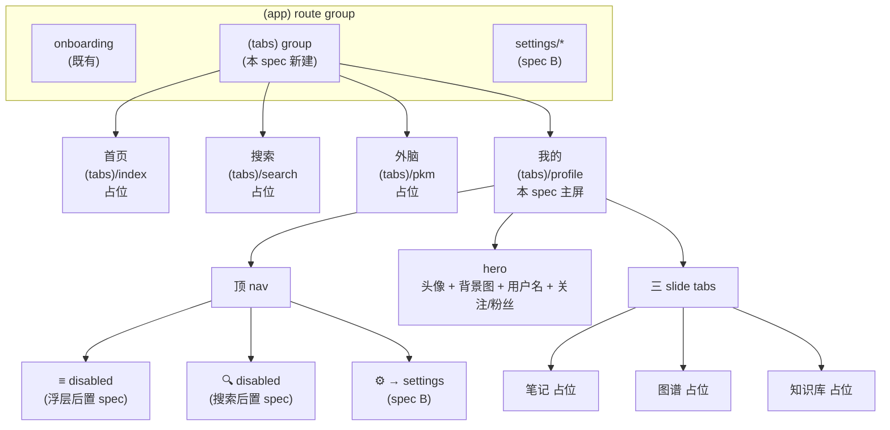
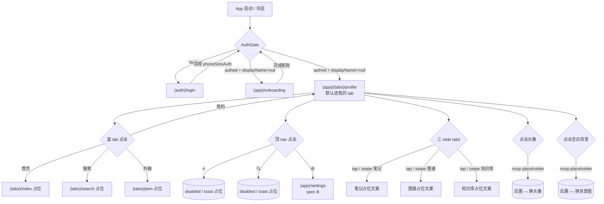

# Feature Specification: My Profile Page (M1.X — `(tabs)` 接入 + 我的页骨架)

**Feature Branch**: `feature/my-profile-spec`
**Created**: 2026-05-07（per [ADR-0017](../../../../docs/adr/0017-sdd-business-flow-first-then-mockup.md) 类 1 标准 UI 流程）
**Status**: Draft（pending /speckit.clarify + plan + tasks）
**Module**: `apps/native/app/(app)/(tabs)/profile`（新建 `(tabs)` group + 4 tab + profile screen）
**Input**: User description: "建一个『我的』页,布局参考网易云音乐 — 顶 nav 三 entry / hero / 关注粉丝占位 / 三 slide tabs(笔记/图谱/知识库)/ 底 tab bar 4 项(首页/搜索/外脑/我的)。底 tab 是当前应用骨架的入口重构,本 spec 是 A → B → C 三步链(我的 → 设置 → 注销/解封 UI)的第一步。"

> 决策约束:
>
> - **per ADR-0017 类 1 流程**:本 spec 阶段产出 docs + 业务流 + 占位 UI;视觉决策(精确 px / hex / 阴影 / 自定义动画 / photo blur 沉浸式背景)**不进 spec / plan**,留 PHASE 2 mockup 落地后回填 plan.md UI 段
> - server 端 0 工作量:`/me` / `logout-all` / `delete-account` / `cancel-deletion` 全部已落地;本 spec 仅读现有 store 的 displayName(由 onboarding 既有 `loadProfile()` 写入)
> - 路由 `apps/native/app/(app)/(tabs)/profile.tsx` — 在 `(app)/(tabs)` 路由组内,受 AuthGate 第一层(`!authed → /(auth)/login`)保护;profile screen 自身无 auth 逻辑
> - **占位 UI 阶段不引入 packages/ui 新组件**(per FR-011);现有共享组件(Button / Spinner 等)可复用,新组件等 PHASE 2 mockup 评估
> - 本 spec 是 SDD 拆分链 A → B → C 的 A;A → B 入口为「我的 → ⚙️ → 设置」,A → C 入口经 B 中转(账号与安全 → 注销账号);本 spec 仅声明 `router.push('/(app)/settings')`,目标实现是 spec B 范围

## Visual References

参考截图 + 用户红框注释 + 决策留痕归档于 [`design/inspiration/`](./design/inspiration/),配合本段阅读以建立完整设计意图:

| 图  | 文件                                                                    | 角色                                  | 本 spec 引用       |
| --- | ----------------------------------------------------------------------- | ------------------------------------- | ------------------ |
| 01  | [01-main-skeleton.png](./design/inspiration/01-main-skeleton.png)       | 主骨架(顶 nav / hero / 列表 / 底 tab) | **本 spec 主参照** |
| 02  | [02-left-drawer.png](./design/inspiration/02-left-drawer.png)           | 顶 nav 左 ≡ 浮层(后置 spec)           | 仅入口占位,不实现  |
| 03  | [03-settings.png](./design/inspiration/03-settings.png)                 | 设置页(spec B)                        | 仅 ⚙️ → 路径占位   |
| 04  | [04-account-security.png](./design/inspiration/04-account-security.png) | 账号与安全(spec B)                    | 经 B 中转,不直引   |

参考来源: 网易云音乐 iOS 端,**仅作 layout / IA 参照**,不引用任何品牌资产、文案、配色;PHASE 2 mockup 阶段产出本项目自身视觉系统。

## Information Architecture

## User Flow

## Clarifications

本段固化对齐过程中的关键决策(Q&A 形式),配合 [`design/inspiration/notes.md`](./design/inspiration/notes.md) 阅读。

### 顶 nav

- **Q1**: 顶 nav 左侧 ≡ 是否带 99+ badge? → **否**,无 badge(参考图原带,删去)
- **Q2**: 顶 nav 中间 "+ 添加状态" 是否保留? → **否**,中间空
- **Q3**: ≡ 点击行为(本批次)? → **disabled / toast 占位**;浮层 list 内容**单起 spec 后置**(参考图 02 仅供未来参考)
- **Q4**: 🔍 点击行为(本批次)? → **disabled / toast 占位**;搜索功能(全局搜 / 搜笔记)**单起 spec 后置**
- **Q5**: ⚙️ 点击行为? → 跳设置页(`router.push('/(app)/settings')`),目标实现是 **spec B**

### Hero 区

- **Q6**: VIP 标记 / 徽章 / ID 显示是否保留? → **全删**(M1 没 billing 模块 / 反枚举防御 SC-008)
- **Q7**: 关注 / 粉丝是真功能还是占位? → **占位假数字** — 全局相同(5 关注 / 12 粉丝),**不可点**;互动模块(真 follow)定为 M5+
- **Q8**: 头像 / 背景图? → 系统默认 placeholder 图(随风格 PHASE 2 定);点击头像 → noop(后置 — 换头像);点击空白背景 → noop(后置 — 换背景图)
- **Q9**: 头像 / 背景图换图功能本批次? → **否**,本批次仅 placeholder + 点击事件 noop;实际换图涉及对象存储 + 上传 client(M2+)

### 三 slide tabs

- **Q10**: 三 tab 名称? → **笔记 / 图谱 / 知识库**(参考图原是音乐/播客/笔记,改成 PKM 视图)
- **Q11**: 是否支持手势滑动切换? → **是**;tap + horizontal swipe 双触发
- **Q12**: tab 内容本批次? → **空占位文案**;真实 PKM 内容(笔记 list / 图谱可视化 / 知识库分类)定为独立模块,**不在本批次**

### 底 tab bar

- **Q13**: 4 项 label? → **首页 / 搜索 / 外脑 / 我的**(参考图原"笔记"改"外脑")
- **Q14**: "外脑" vs "PKM" label 选哪个? → **外脑**(中文人格化,代码 path 用 `pkm`)
- **Q15**: 底 tab 图标? → 本批次**仅 label 文字**,无图标;图标系统由 PHASE 2 mockup 决定
- **Q16**: 其他 3 个 tab(首页 / 搜索 / 外脑)本批次范围? → **空 placeholder page**(每页含 PHASE 1 banner + "功能即将推出"占位文案);真内容**单起 spec**

### 未登录态

- **Q17**: 用户从底 tab 点「我的」未登录 → ? → **AuthGate 第一层拦截 → router.replace `/(auth)/login`**;profile screen 自身不做未登录判断

### 默认 landing

- **Q18**: AuthGate 第三态(已登录 + onboarded)默认进哪个 tab? → **我的 tab**(本批次唯一有内容的 tab)
- **Q19**: 现有 `/(app)/index.tsx`(home 占位) → ? → **替换为 `(tabs)/index.tsx`**(首页 tab,仍是占位)

### 视觉占位边界

- **Q20**: photo blur / 沉浸式背景视觉本批次? → **否**(per ADR-0017 占位 UI 边界);PHASE 2 mockup 落地
- **Q21**: 是否引入 packages/ui 新抽象组件(`<TabBar>` / `<ProfileHero>` 等)? → **否**;PHASE 2 mockup 后再评估

### Cross-cutting Clarifications(/speckit.clarify round 1 — 2026-05-07)

- **CL-001 — 滚动 paradigm**(hero + slide tabs + 内容区) → **(b) sticky tabs** — hero 跟随整页滚动消失 → 三 slide tabs 触顶钉住(钉在顶 nav 下方)→ 内容区在 sticky tabs 下延续滚动(网易云风格)。具体技术实现(单 `<ScrollView>` + `stickyHeaderIndices` / `react-native-collapsible-tab-view` / `react-native-pager-view` 组合)**留 plan.md 决**;占位 UI 阶段如 swipe + sticky 组合复杂度过高,可先降级仅 tap 切换 + sticky 滚动(per Open Question 1)
- **CL-002 — 底 tab bar 在 settings / 注销等 stack push 后是否可见** → **(b) push 后隐藏** — settings / 账号与安全 / 注销 / 解封 等"专注操作"stack 路由放在 `apps/native/app/(app)/settings/*`(即 `(app)/(tabs)/` **之外**),Expo Router 默认在 `(tabs)` 之外的 stack 自动隐藏底 tab bar;返回 profile 后底 tab 恢复
- **CL-003 — 跨底 tab 切换后三 slide tabs activeTab 是否保持** → **(a) 保持** — Expo Router Tabs 默认 tab 不 unmount(`unmountOnBlur=false`),activeTab in-session 内保持;冷启 / app 重启回 'notes'(per FR-008 不 persist);无额外实现成本
- **CL-004 — 未登录用户 deep link 直接访问 `/(tabs)/profile`** → **(a) AuthGate 第一层拦截 → router.replace `/(auth)/login`** — 与点底 tab 同 UX(per User Story 2);profile screen 自身仍**不**做 auth 判断,统一由 AuthGate 既有逻辑处理
- **CL-005 — 冷启 landing tab(URL 记忆 vs 强制回我的)** → **(b) 强制回我的 tab** — M1.X 简化:AuthGate 第三态固定 `(tabs)/profile`(per FR-002);用户上次离开在 "首页" tab,冷启回 "我的" tab(其他 tab 占位无内容,回别的 tab 体验差);PHASE 2+ 引入 URL state 记忆再评估

## User Scenarios & Testing _(mandatory)_

### User Story 1 — 已登录用户进入「我的」 tab(Priority: P1)

已 onboarded 用户(`displayName!=null`)冷启 / 登录完成 → AuthGate 第三态 → 默认 landing 在 `(app)/(tabs)/profile` → 渲染 hero(头像 / 用户名 / 假关注粉丝)+ 三 slide tabs(默认笔记)+ 顶 nav 三 entry。

**Why this priority**: 主路径,所有已 onboarded 用户冷启 / 登录后必经。

**Independent Test**: vitest + msw mock `/me` 返 `{displayName: "小明"}` → 渲染 root layout → 断言 router decision 为 `(app)/(tabs)/profile` + profile screen 渲染包含 "小明" + "5 关注" / "12 粉丝" 文案。

**Acceptance Scenarios**:

1. **Given** 用户 displayName="小明",**When** AuthGate 评估,**Then** decision = `(app)/(tabs)/profile`
2. **Given** profile screen render 完成,**When** 检查 hero 区,**Then** 显示 "小明" + 关注/粉丝假数字 + 头像 placeholder + 背景图 placeholder
3. **Given** 三 slide tabs 渲染,**When** 检查 active tab,**Then** 默认为 "笔记",underline 在第一个

---

### User Story 2 — 未登录用户点底 tab「我的」(Priority: P1,并列)

未登录用户(`!authed`)从其他 tab 点击底 tab「我的」 → AuthGate 第一层拦截 → `router.replace('/(auth)/login')`,profile screen **不渲染**。

**Why this priority**: 未登录态首要不变性 — 不能让未登录态读到任何用户数据(即使是假数字)。

**Independent Test**: vitest + auth store 设 `accountId=null / accessToken=null` → 模拟点击底 tab "我的" → 断言 router.replace 调用为 `/(auth)/login` + profile screen 未 render。

**Acceptance Scenarios**:

1. **Given** auth store 空,**When** 用户点底 tab「我的」,**Then** AuthGate 拦截 → router.replace `/(auth)/login`
2. **Given** 在 login 页完成 phoneSmsAuth,**When** AuthGate 重 evaluate(且 displayName!=null),**Then** router.replace 回 `(app)/(tabs)/profile`(不是 onboarding)

---

### User Story 3 — 三 slide tabs 切换 + sticky 滚动(Priority: P1,并列)

用户在 profile screen 点击三 slide tabs("笔记" / "图谱" / "知识库") → active tab 改变 + tab 内容区切换占位文案;underline 视觉跟随。**滚动到 tabs 触顶时,tabs 钉在顶 nav 下方,hero 区已滚出视口;内容区继续向上滚动**(sticky tabs paradigm,per CL-001 (b))。Swipe 行为视 plan.md 评估(Open Question 1)。

**Why this priority**: 主交互 + 主 IA 验证 — slide tabs 是 PKM 视图未来落点;sticky 滚动是参考图核心视觉骨架。

**Independent Test**: vitest + RTL → 渲染 profile screen → fireEvent 点 "图谱" tab → 断言 active tab state = "图谱" + 内容区 textContent = "图谱占位文案"(具体文案 per FR-013);scroll 模拟测 sticky 行为(scrollTo y > heroHeight → tabs 容器 sticky 状态触发,具体断言方式 plan.md 决,可能需 RTL fireEvent 'scroll' + style assertion)。

**Acceptance Scenarios**:

1. **Given** active tab = 笔记,**When** 用户点 "图谱",**Then** active tab = 图谱 + 内容区切换 + underline 移到第二
2. **Given** active tab = 笔记,**When** swipe 启用且用户向左 swipe(plan.md 决是否启用),**Then** active tab = 图谱(下一 tab)
3. **Given** active tab = 知识库(最后一个),**When** 用户向左 swipe(若启用),**Then** **保持**(无下一 tab,不循环)
4. **Given** profile screen 内容区可滚动(超过屏高),**When** 用户向上滚 hero 已滚出视口,**Then** 三 slide tabs 钉在顶 nav 下方;**继续滚动**只滚内容区,sticky tabs 视觉位置不变

---

### User Story 4 — 点击 ⚙️ 跳设置(Priority: P1,并列)

用户在 profile screen 点击顶 nav 最右 ⚙️ → `router.push('/(app)/settings')`。

**Why this priority**: A → B 入口,链路验证。

**Independent Test**: vitest + RTL → 渲染 profile screen → fireEvent 点 ⚙️ icon → 断言 router.push 调用为 `/(app)/settings`(目标实现在 spec B,本 spec 仅断言路径)。

**Acceptance Scenarios**:

1. **Given** profile screen render 完成,**When** 用户点 ⚙️,**Then** router.push `/(app)/settings`
2. **Given** spec B 未实现(目标 route 缺失),**When** 用户点 ⚙️,**Then** Expo Router 行为容错(导航失败不 crash;此期间用户视觉上停留 profile;实际 spec B impl 会让 route 存在)

---

### User Story 5 — 顶 nav ≡ / 🔍 占位(Priority: P2)

用户点击顶 nav 左 ≡ 或 🔍 → 占位反馈(无操作 / "暂未开放" toast,具体形式 PHASE 2 mockup 决定);**不**触发任何 navigation。

**Why this priority**: 占位入口可见性,防误用;真功能后置 spec。

**Independent Test**: vitest + RTL → fireEvent 点 ≡ → 断言无 router 调用 + 无 alert / no-op;同样测 🔍。

**Acceptance Scenarios**:

1. **Given** profile screen,**When** 用户点 ≡ 或 🔍,**Then** 无 router 调用 + 视觉上有 disabled 状态指示(如 opacity 减 / pressed 反馈)
2. **Given** PHASE 1,**When** 同样点击,**Then** 可选弹 toast "敬请期待"(PHASE 2 mockup 定 toast 文案 / 形式)

---

### User Story 6 — 头像 / 背景图点击占位(Priority: P2)

用户点击头像 → noop(后置 — 换头像);点击空白背景 → noop(后置 — 换背景图)。

**Why this priority**: hero 区 affordance 一致性 — 让占位有明确"未来可点击"信号但不实际操作。

**Independent Test**: vitest + RTL → fireEvent 点头像 / 背景空白 → 断言无 router 调用 + 无文件选择器调用。

**Acceptance Scenarios**:

1. **Given** profile screen,**When** 用户点头像,**Then** 触发 onPress 但 handler 是 noop(可加 console.debug 占位 log)
2. **Given** 同上,**When** 用户点空白背景,**Then** 同样 noop

---

### User Story 7 — 底 tab bar 4 项切换(Priority: P1,并列)

用户在 `(tabs)` 内点底 tab → 切换到对应 tab screen;非「我的」 tab 渲染占位文案 "功能即将推出"。

**Why this priority**: 应用骨架基础;tab 切换不抖、URL 正确变化是 navigation 健康度信号。

**Independent Test**: vitest + RTL → 渲染 `(tabs)` layout → fireEvent 依次点 4 个 tab → 断言每次 active tab 切换 + 内容区切换 + URL 变化。

**Acceptance Scenarios**:

1. **Given** active tab = 我的,**When** 用户点 "首页" tab,**Then** active tab = 首页 + 内容区 = 首页占位 + URL `/(tabs)/`(index)
2. **Given** active tab = 首页,**When** 用户点 "搜索" / "外脑" / "我的",**Then** 各自切换正确
3. **Given** 任意 tab,**When** 用户重复点同一 tab,**Then** noop(不重新 mount)

---

### User Story 8 — Rehydrate 不抖(Priority: P1,并列)

用户已在 `(app)/(tabs)/profile` 或其他 tab 内,刷新 / 冷启 app 后 AuthGate 应保持当前 tab;不闪 splash → login → onboarding → profile 多余跳转。

**Why this priority**: 体验细节 — 刷新闪烁是 RN Web 上肉眼可见的 D 类 bug。

**Independent Test**: 模拟 store rehydrate 完成(含 displayName) → AuthGate 首次 render → 断言 router.replace 调用次数 = 0。

**Acceptance Scenarios**:

1. **Given** rehydrate 完成 + displayName="小明" + URL=`(tabs)/profile`,**When** 首次 render,**Then** stay,无 router.replace
2. **Given** rehydrate in-flight,**When** 首次 render,**Then** 渲染 splash / loading 占位,不立即跳路由

---

### Edge Cases

- **加载 `/me` 失败**(M1.2 既有 onboarding 流处理):AuthGate 不死锁;fallback = stay 当前路由 + 静默重试 / retry 按钮
- **profile screen render 时 displayName 仍为 null**(竞态):罕见;直接渲染占位 "未命名" 而非闪 onboarding(因 AuthGate 应已分流)
- **三 slide tabs 横滑距离不足以切换**:沿用 `react-native-pager-view` 或自实现 threshold(plan.md 决定),太短手势 → 回弹原 tab
- **底 tab bar SafeArea 适配**(iOS home indicator):用 `useSafeAreaInsets()` paddingBottom;`(tabs)/_layout.tsx` 内统一处理
- **手势冲突**(三 slide tabs swipe vs 底 tab swipe):底 tab bar 不响应 horizontal swipe(默认行为),仅 tap 切换;无冲突
- **小屏 / 长用户名**:用户名 > 屏宽时 `numberOfLines=1` + `ellipsizeMode='tail'`
- **横屏旋转**(M1 仅竖屏):假设竖屏锁定(per existing app config);本 spec 不处理横屏
- **Android hardware back in `(tabs)`**:用户在 `(tabs)/profile` 按 back → 沿用 Expo Router Tabs 默认行为(若 tab 内有 navigation history 先 pop;否则 exit app);跨 tab 切换不计入 back history(默认 `backBehavior: 'firstRoute'` 等行为视 Expo Router 版本);plan.md / T8 集成测验证默认行为符合预期,若不符再加 `Tabs.Screen` 的 `backBehavior` 配置

---

## Functional Requirements _(mandatory)_

| ID     | 需求                                                                                                                                                                                                                                                                                                                                                                                                                                                  |
| ------ | ----------------------------------------------------------------------------------------------------------------------------------------------------------------------------------------------------------------------------------------------------------------------------------------------------------------------------------------------------------------------------------------------------------------------------------------------------- |
| FR-001 | 新建 `(tabs)` 路由组:`apps/native/app/(app)/(tabs)/_layout.tsx` 含 Tabs.Screen × 4(`index` / `search` / `pkm` / `profile`);label 中文(`首页 / 搜索 / 外脑 / 我的`),代码 path 用英文(`(tabs)/index` `(tabs)/search` `(tabs)/pkm` `(tabs)/profile`)                                                                                                                                                                                                     |
| FR-002 | AuthGate 第三态目标从 `/(app)/` 改为 `/(app)/(tabs)/profile`(默认进我的 tab — 本批次唯一有内容的 tab);决策函数 `auth-gate-decision.ts` 同步更新                                                                                                                                                                                                                                                                                                       |
| FR-003 | `(tabs)/index.tsx` / `(tabs)/search.tsx` / `(tabs)/pkm.tsx` 三个 placeholder page;每页含 `// PHASE 1 PLACEHOLDER` banner + 单一 `<Text>功能即将推出</Text>`;现有 `/(app)/index.tsx` 替换为 `(tabs)/index.tsx`(内容相同)                                                                                                                                                                                                                               |
| FR-004 | profile screen(`(tabs)/profile.tsx`):顶 nav 区(三 entry) + hero 区(头像 / 背景 / 用户名 / 关注粉丝) + 三 slide tabs 区(笔记 / 图谱 / 知识库 + 内容占位)                                                                                                                                                                                                                                                                                               |
| FR-005 | 顶 nav 三 entry:左 `<Pressable>≡</Pressable>` (disabled handler) / 中右 `<Pressable>🔍</Pressable>` (disabled handler) / 最右 `<Pressable>⚙️</Pressable>` (`router.push('/(app)/settings')`);settings stack **位于 `(app)/settings/*`**(即 `(tabs)/` **之外**,per CL-002),Expo Router 默认隐藏底 tab bar;具体图标资源 PHASE 2 决定,占位用 emoji 或 `<Text>` 字符                                                                                      |
| FR-006 | hero 区:头像 placeholder 图(`packages/ui/src/assets/avatar-placeholder-default.png` 等系统默认资源,具体文件名 plan.md 定);用户名读 `useAuthStore(s => s.displayName)`;头像 + 空白背景 `<Pressable>` onPress = noop placeholder(可加 `console.debug('[my-profile] avatar press — placeholder')`)                                                                                                                                                       |
| FR-007 | 关注 / 粉丝行:渲染 `<Text>5 关注</Text>` + `<Text>12 粉丝</Text>`(全局假数字,常量定义在 page top);**非交互**(无 `<Pressable>` 包裹)                                                                                                                                                                                                                                                                                                                   |
| FR-008 | 三 slide tabs 状态机:`activeTab: 'notes' \| 'graph' \| 'kb'`,初始 `'notes'`(默认笔记);切换由 **tap** 触发(必含);horizontal **swipe** 触发(可选,plan.md 决定是否本批次实现 — 见 Open Question 1);**不 persist**(冷启回 'notes',跨底 tab 切走再回**保持** per CL-003)                                                                                                                                                                                   |
| FR-018 | 滚动行为(per CL-001 (b) sticky tabs):整页有单一垂直滚动容器;hero 区随滚动消失;三 slide tabs 区触顶后**钉在顶 nav 下方**(sticky);内容区在 sticky tabs 下延续滚动。具体实现选型(单 `<ScrollView>` + `stickyHeaderIndices` / 第三方 collapsible-tab-view / pager-view 组合)由 plan.md 决,占位 UI 阶段倾向最简方案(单 ScrollView + stickyHeaderIndices)                                                                                                   |
| FR-009 | 三 slide tabs 内容区:每 tab 渲染单 `<Text>` 占位文案(如 "笔记内容即将推出");无实际数据 fetch / 列表 / 卡片                                                                                                                                                                                                                                                                                                                                            |
| FR-010 | 占位 UI 4 边界(per ADR-0017 类 1 强制纪律):路由结构(FR-001) ✓ / 单层 form-equivalent 输入(本 spec 无 input — 替代为"状态切换"是 slide tabs activeTab) / 提交事件(替代为 tab 切换 + nav button press) / 状态机视觉指示(active tab underline / disabled 状态 opacity) / 错误展示位(本 spec 无网络请求 — 无错误展示);**全裸 RN,禁引 packages/ui 新抽组件**;每 page 顶 `// PHASE 1 PLACEHOLDER — business flow validated; visuals pending mockup.` banner |
| FR-011 | 不引入新 packages/ui 抽象组件(如 `<ProfileHero>` / `<SlideTabs>` / `<TopBar>`);现有共享组件(`Spinner` 等)按需复用;新组件 PHASE 2 mockup 落地后再评估                                                                                                                                                                                                                                                                                                  |
| FR-012 | 底 tab bar 占位视觉:Expo Router `Tabs` 默认 options(label + title 中文);**无图标**(`tabBarIcon: undefined`);图标系统由 PHASE 2 mockup 决定;active 视觉用 Expo Router 默认行为                                                                                                                                                                                                                                                                         |
| FR-013 | i18n 不引入(per CLAUDE.md M1 现状);所有文案硬编中文,但**集中在 page top const**(如 `const COPY = { followers: '5 关注', ... }`)以方便后续抽离                                                                                                                                                                                                                                                                                                         |
| FR-014 | a11y:三 slide tabs 用 `accessibilityRole='tab'` + `accessibilityState.selected`;顶 nav 三 entry `accessibilityRole='button'` + `accessibilityLabel`;disabled entry `accessibilityState.disabled=true`;hero 头像 / 背景 `accessibilityHint='点击更换'`(尽管 noop)                                                                                                                                                                                      |
| FR-015 | SafeArea 适配:`(tabs)/_layout.tsx` 用 `useSafeAreaInsets()` 处理底 tab bar 高度 + iOS home indicator;profile screen 顶部用既有 `<SafeAreaView>` 模式(per onboarding)                                                                                                                                                                                                                                                                                  |
| FR-016 | 未登录态由 AuthGate 第一层处理(per onboarding spec FR-001);profile screen 自身**不**做 auth 判断                                                                                                                                                                                                                                                                                                                                                      |
| FR-017 | 头像 / 背景占位资源:**不引图片资源**(per plan.md 决策 2);头像用 `<View>` + `<Text>👤</Text>`(系统 emoji 字体),背景用裸 `<View>`(无图);PHASE 2 mockup 落地时一并引入实际 PNG / SVG。理由:占位 UI 4 边界严禁视觉决策(per ADR-0017),图片资源涉及尺寸 / 风格 / 主题 — 本批次不锁                                                                                                                                                                          |

---

## Success Criteria _(mandatory)_

| ID     | 标准                                                                                                                                                                                                  | 测量方式                                                          |
| ------ | ----------------------------------------------------------------------------------------------------------------------------------------------------------------------------------------------------- | ----------------------------------------------------------------- |
| SC-001 | User Story 1-8 全部 happy path 单测通过                                                                                                                                                               | `pnpm --filter native test` + `pnpm --filter @nvy/auth test` 全绿 |
| SC-002 | AuthGate 第三态目标更新为 `(tabs)/profile` 且不抖:9 子 case 单测断言(per onboarding SC-002 模式扩展)                                                                                                  | vitest 表驱动                                                     |
| SC-003 | 三 slide tabs 状态机:`activeTab` 三态 × tap/swipe 触发 = 6 子 case 单测断言切换 + active 视觉指示                                                                                                     | vitest                                                            |
| SC-004 | 占位 UI 0 视觉决策:`(tabs)/profile.tsx` + `(tabs)/_layout.tsx` + 3 placeholder page **不含** hex / px / rgb 字面量 / 复杂样式属性(除 `flex` / `padding` 等基础布局)/ 新 packages/ui import            | grep 静态分析 + manual review                                     |
| SC-005 | 真后端冒烟:Playwright 跑(已 onboarded 用户) → 进 `(tabs)/profile` → 渲染 hero + 三 slide tabs → tap "图谱" tab 切换 → 点 ⚙️ 触发 router.push `/(app)/settings`(spec B 未实现时容错不 crash)→ 截图归档 | 手动跑 + `runtime-debug/2026-05-XX-my-profile-business-flow/`     |
| SC-006 | 反枚举不变性:profile screen / hero 区**不读 / 不渲染** `account.id` 数字;grep `accountId` 在本 spec 实现文件**仅**用于 store key 访问(不出现在 `<Text>{accountId}>` 等 render)                        | grep 静态分析                                                     |
| SC-007 | rehydrate 不抖:已 onboarded 用户冷启在 `(tabs)/profile` → AuthGate 首次 render → router.replace 调用次数 = 0                                                                                          | vitest                                                            |
| SC-008 | 底 tab bar 视觉占位:渲染 4 个 label(首页 / 搜索 / 外脑 / 我的),无图标 / 自定义视觉决策                                                                                                                | manual review + grep `tabBarIcon` 应为 undefined                  |
| SC-009 | 现有 `/(app)/index.tsx` 已迁移为 `(tabs)/index.tsx`(首页 tab):git diff 验证 file rename;原 home 占位文案保留或更新为 "首页内容即将推出"                                                               | git diff + manual                                                 |
| SC-010 | logout 路径不影响 tabs 结构:`logoutLocal` / `logoutAll`(既有)被调用后,`(tabs)` umount 干净 → 跳 `/(auth)/login` 无残留 view                                                                           | vitest 集成测                                                     |

---

## Out of Scope(M1.X 显式不做)

- **mockup / 视觉完成**(per ADR-0017 类 1 流程,PHASE 2 后置)— 占位 UI 阶段不做精确间距 / 颜色 / 字号 / 阴影 / photo blur 沉浸式背景 / 自定义动画 / 底 tab 图标系统
- **顶 nav 左 ≡ 浮层 list 内容**(扫码 / 消息 / 用户菜单 等)— 单起 spec
- **顶 nav 🔍 搜索功能**(全局搜 / 搜笔记)— 单起 spec
- **三 slide tabs 实际 PKM 内容**(笔记 list / 图谱可视化 / 知识库分类)— 独立模块,各起 spec
- **底 tab bar 其他 3 项**(首页 / 搜索 / 外脑)实际内容 — 各起 spec
- **互动模块**(关注 / 粉丝交互真功能)— M5+
- **多账号 / 切换账号能力** — M2+
- **换头像 / 换背景图** — M2+(需对象存储 + 上传 client)
- **本批次 `(tabs)` 之外的设置 / 账号与安全 / 注销 / 解封 UI** — spec B / spec C
- **`packages/ui` 新抽组件**(`<TopBar>` / `<ProfileHero>` / `<SlideTabs>` 等) — PHASE 2 mockup 后评估
- **国际化 i18n** — M3+
- **iOS / Android 真机渲染验证** — M2.1
- **横屏 / 大屏适配**(iPad / Foldable 等) — M2+

---

## Assumptions & Dependencies

- **AuthGate 既有**(per onboarding spec FR-001):本 spec 仅扩展第三态目标(`(app)/` → `(tabs)/profile`),不改三态逻辑
- **`packages/auth` 既有 store**:`accountId / accessToken / refreshToken / displayName` 已 persist;本 spec 不增字段
- **`packages/api-client` 既有 `getAccountProfileApi().getMe()`**(per onboarding):本 spec 不直接调,profile screen render 时 displayName 已 in store
- **Expo Router `(tabs)` group 能力**:Expo Router v6+ Tabs 文档 — 既有依赖
- **`react-native-safe-area-context`** 既有(per onboarding 用法)
- **swipe 实现选型**:候选 `react-native-pager-view`(成熟,需 prebuild) vs 自实现 PanResponder(无新依赖);plan.md 决
- **mockup PHASE 2** 由 Claude Design 单独产出(按 [`docs/experience/claude-design-handoff.md`](../../../../../docs/experience/claude-design-handoff.md) § 2.1b 合一页 prompt 模板),落 `apps/native/spec/my-profile/design/source-v1/`;本 PR **不**等 mockup
- **server 端 0 工作量**:`/me` / `logout-all` / `delete-account` / `cancel-deletion` 全部已落地(M1.3 PR #131-138)
- **spec B / spec C** 后续 PR 落地;本 spec 仅占位 `router.push('/(app)/settings')`,目标缺失时 Expo Router 容错(navigate to undefined route 行为按 framework 默认 — 不 crash)

---

## Open Questions

| #   | 问                                                        | 决议                                                                                                                                                                                                                                                                                                                                                                            |
| --- | --------------------------------------------------------- | ------------------------------------------------------------------------------------------------------------------------------------------------------------------------------------------------------------------------------------------------------------------------------------------------------------------------------------------------------------------------------- |
| 1   | swipe + sticky tabs 组合实现选型(per CL-001 (b))          | 🟡 plan.md 决,候选: (a) 单 `<ScrollView>` + `stickyHeaderIndices` + **仅 tap 切换**(最简,占位 UI 阶段倾向);(b) `react-native-collapsible-tab-view`(成熟但第三方,需 prebuild + bundle 增量);(c) `<ScrollView>` + 内嵌 `react-native-pager-view`(自组合,处理嵌套 scroll 复杂);**占位 UI 阶段如复杂度 > 收益,先降级 swipe 为 PHASE 2 mockup 后置**,本批次仅 tap 切换 + sticky 滚动 |
| 2   | 关注 / 粉丝具体假数字                                     | ✅ **5 关注 / 12 粉丝**(per Q7 决策)                                                                                                                                                                                                                                                                                                                                            |
| 3   | 头像 / 背景 placeholder 资源选哪张                        | 🟡 plan.md 决:中性视觉(灰色 / 中性蓝灰渐变),与未来 mockup 风格不冲突;如有 packages/ui 现成资源复用,否则 apps/native/assets/ 新增                                                                                                                                                                                                                                                |
| 4   | 顶 nav ≡ / 🔍 disabled 反馈形式                           | 🟡 PHASE 1:无 toast / 仅视觉 disabled(opacity 0.5);PHASE 2 mockup 决定是否加 toast / hover 提示                                                                                                                                                                                                                                                                                 |
| 5   | 三 slide tabs 切换是否带过渡动画                          | 🟡 PHASE 1:无动画 / 直接切;PHASE 2 mockup 决定                                                                                                                                                                                                                                                                                                                                  |
| 6   | 底 tab bar 切换是否带过渡动画 / lazy load 其他 tab        | 🟡 PHASE 1:Expo Router 默认行为(lazy=true,不预 mount);PHASE 2 mockup 决定                                                                                                                                                                                                                                                                                                       |
| 7   | 用户名长度溢出处理                                        | ✅ `numberOfLines=1` + `ellipsizeMode='tail'`(per Edge Cases)                                                                                                                                                                                                                                                                                                                   |
| 8   | profile screen 是否需 pull-to-refresh                     | 🟡 PHASE 1:**不**;本 spec 无网络数据展示(displayName 已 in store);PHASE 2 决定是否加                                                                                                                                                                                                                                                                                            |
| 9   | iOS 物理 back / Android hardware back 在 tab 切换时的行为 | 🟡 PHASE 1:沿用 Expo Router Tabs 默认(Android back 退回上一 tab,iOS 无 hardware back);plan.md 验证默认行为符合预期                                                                                                                                                                                                                                                              |

---

## 变更记录

- **2026-05-07**:本 spec 首次创建。基于 4 张参考截图(归档 design/inspiration/) + 用户红框注释 + 21 项 Clarification Q&A 对齐。spec 阶段产出业务流 / 占位 UI 边界 / a11y / 路由结构;PHASE 2 mockup 由 Claude Design 单独产出后回填 plan.md UI 段。本 spec 是 SDD 拆分链 A → B → C 的 A,后续 PR 衔接 spec B(account-settings-shell) / spec C(delete-account-cancel-deletion-ui)。
- **2026-05-07 +1**:`/speckit.clarify` round 1 — 追加 5 项 Cross-cutting Clarifications(CL-001 ~ CL-005):滚动 paradigm 锁 sticky tabs(CL-001 (b)) / settings stack 在 `(tabs)` 之外底 tab 隐藏(CL-002 (b)) / activeTab in-session 保持(CL-003) / deep link 由 AuthGate 拦截(CL-004) / 冷启强制回我的 tab(CL-005)。同步修订:FR-005 加 settings 路径声明 / FR-008 swipe 改可选(plan.md 决) / 新增 FR-018 sticky 滚动行为 / User Story 3 加 sticky 滚动 acceptance scenario / Open Question 1 重写为 swipe + sticky 组合选型。
